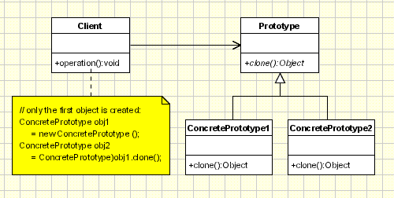

## 7. [原型模式（Prototype](https://www.oodesign.com/prototype-pattern.html)

### Motivation

Today’s programming is all about costs. Saving is a big issue when it comes to using computer resources, so programmers are doing their best to find ways of improving the performance. When we talk about object creation we can find a better way to have new objects: cloning. To this idea one particular design pattern is related: rather than creation it uses cloning. If the cost of creating a new object is large and creation is resource intensive, we clone the object.

The Prototype design pattern is the one in question. It allows an object to create customized objects without knowing their class or any details of how to create them. Up to this point it sounds a lot like the Factory Method pattern, the difference being the fact that for the Factory the palette of prototypical objects never contains more than one object.

### Intent

使用原型实例指定要创建对象的类型，通过复制这个原型来创建新对象。

> specifying the kind of objects to create using a prototypical instance

> creating new objects by copying this prototype

### Class Diagram

<div align="center">  </div><br>


The classes participating to the Prototype Pattern are:

> - **Client** - creates a new object by asking a prototype to clone itself.
> - **Prototype** - declares an interface for cloning itself.
> - **ConcretePrototype** - implements the operation for cloning itself.

Here is a sample code for the Prototype pattern:

````java
public interface Prototype {
	public abstract Object clone ( );
}
public class ConcretePrototype implements Prototype {
	public Object clone() {
		return super.clone();
	}
}
public class Client {
	public static void main( String arg[] ) 
	{
		ConcretePrototype obj1= new ConcretePrototype ();
		ConcretePrototype obj2 = ConcretePrototype(obj1).clone();
	}
}
````


### Implementation

```java
public abstract class Prototype {
    abstract Prototype myClone();
}
public class ConcretePrototype extends Prototype {

    private String filed;

    public ConcretePrototype(String filed) {
        this.filed = filed;
    }

    @Override
    Prototype myClone() {
        return new ConcretePrototype(filed);
    }

    @Override
    public String toString() {
        return filed;
    }
}
public class Client {
    public static void main(String[] args) {
        Prototype prototype = new ConcretePrototype("abc");
        Prototype clone = prototype.myClone();
        System.out.println(clone.toString());
    }
}
```

```html
abc
```

### Applicability & Examples

Use Prototype Pattern when a system should be independent of how its products are created, composed, and represented, and:

- Classes to be instantiated are specified at run-time
- Avoiding the creation of a factory hierarchy is needed
- It is more convenient to copy an existing instance than to create a new one.

#### Example 1

In building stages for a game that uses a maze and different visual objects that the character encounters it is needed a quick method of generating the haze map using the same objects: wall, door, passage, room... The Prototype pattern is useful in this case because instead of hard coding (using new operation) the room, door, passage and wall objects that get instantiated, CreateMaze method will be parameterized by various prototypical room, door, wall and passage objects, so the composition of the map can be easily changed by replacing the prototypical objects with different ones.

The Client is the CreateMaze method and the ConcretePrototype classes will be the ones creating copies for different objects.


### Specific problems 

- Using a prototype manager
- Implementing the Clone operation
- Initializing clones


### Hot points

- **Prototype Manager** – implemented usually as a hashtable keeping the object to clone. When use it, prototype become a factory method which uses cloning instead of instantiation.
- **Deep Clones vs. Shallow Clones** – when we clone complex objects which contains other objects, we should take care how they are cloned. We can clone contained objects also (deep cloning) or we can the same reference for them, and to share them between cloned container objects.
- **Initializing Internal States** – there are certain situations when objects need to be initialized after they are created.


### JDK

- [java.lang.Object#clone()](http://docs.oracle.com/javase/8/docs/api/java/lang/Object.html#clone%28%29)
