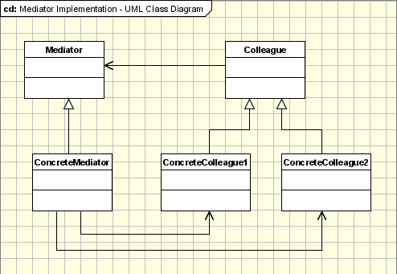

## 5. [中介者 (Mediator)](https://www.oodesign.com/mediator-pattern.html)

### Motivation

In order to have a good object oriented design we have to create lots of classes interacting one with each other. If certain principles are not applied the final framework will end in a total mess where each object relies on many other objects in order to run. In order to avoid tight coupled frameworks, we need a mechanism to facilitate the interaction between objects in a manner in that objects are not aware of the existence of other objects.

Let's take the example of a screen. When we create it we add all sort of controls to the screen. This control need to interact with all the other control. For example when a button is pressed it must know if the data is valid in other controls. As you have seen if you created different applications using forms you don't have to modify each control class each time you add a new control to the form. All the operations between controls are managed by the form class itself. This class is called mediator.


### Intent

集中相关对象之间复杂的沟通和控制方式。

> Define an object that encapsulates how a set of objects interact. Mediator promotes loose coupling by keeping objects from referring to each other explicitly, and it lets you vary their interaction independently.


### Class Diagram


- Mediator：中介者，定义一个接口用于与各同事（Colleague）对象通信。
- Colleague：同事，相关对象


- Mediator - defines an interface for communicating with Colleague objects.
- ConcreteMediator 
    - knows the colleague classes and keep a reference to the colleague objects.
    - implements the communication and transfer the messages between the colleague classes
- Colleague classes 
    - keep a reference to its Mediator object
    - communicates with the Mediator whenever it would have otherwise communicated with another Colleague.


<div align="center">  </div><br>

### Implementation

Alarm（闹钟）、CoffeePot（咖啡壶）、Calendar（日历）、Sprinkler（喷头）是一组相关的对象，在某个对象的事件产生时需要去操作其它对象，形成了下面这种依赖结构：

<div align="center">  </div><br>

使用中介者模式可以将复杂的依赖结构变成星形结构：

<div align="center">  </div><br>

```java
public abstract class Colleague {
    public abstract void onEvent(Mediator mediator);
}
```

```java
public class Alarm extends Colleague {

    @Override
    public void onEvent(Mediator mediator) {
        mediator.doEvent("alarm");
    }

    public void doAlarm() {
        System.out.println("doAlarm()");
    }
}
```

```java
public class CoffeePot extends Colleague {
    @Override
    public void onEvent(Mediator mediator) {
        mediator.doEvent("coffeePot");
    }

    public void doCoffeePot() {
        System.out.println("doCoffeePot()");
    }
}
```

```java
public class Calender extends Colleague {
    @Override
    public void onEvent(Mediator mediator) {
        mediator.doEvent("calender");
    }

    public void doCalender() {
        System.out.println("doCalender()");
    }
}
```

```java
public class Sprinkler extends Colleague {
    @Override
    public void onEvent(Mediator mediator) {
        mediator.doEvent("sprinkler");
    }

    public void doSprinkler() {
        System.out.println("doSprinkler()");
    }
}
```

```java
public abstract class Mediator {
    public abstract void doEvent(String eventType);
}
```

```java
public class ConcreteMediator extends Mediator {
    private Alarm alarm;
    private CoffeePot coffeePot;
    private Calender calender;
    private Sprinkler sprinkler;

    public ConcreteMediator(Alarm alarm, CoffeePot coffeePot, Calender calender, Sprinkler sprinkler) {
        this.alarm = alarm;
        this.coffeePot = coffeePot;
        this.calender = calender;
        this.sprinkler = sprinkler;
    }

    @Override
    public void doEvent(String eventType) {
        switch (eventType) {
            case "alarm":
                doAlarmEvent();
                break;
            case "coffeePot":
                doCoffeePotEvent();
                break;
            case "calender":
                doCalenderEvent();
                break;
            default:
                doSprinklerEvent();
        }
    }

    public void doAlarmEvent() {
        alarm.doAlarm();
        coffeePot.doCoffeePot();
        calender.doCalender();
        sprinkler.doSprinkler();
    }

    public void doCoffeePotEvent() {
        // ...
    }

    public void doCalenderEvent() {
        // ...
    }

    public void doSprinklerEvent() {
        // ...
    }
}
```

```java
public class Client {
    public static void main(String[] args) {
        Alarm alarm = new Alarm();
        CoffeePot coffeePot = new CoffeePot();
        Calender calender = new Calender();
        Sprinkler sprinkler = new Sprinkler();
        Mediator mediator = new ConcreteMediator(alarm, coffeePot, calender, sprinkler);
        // 闹钟事件到达，调用中介者就可以操作相关对象
        alarm.onEvent(mediator);
    }
}
```

```java
doAlarm()
doCoffeePot()
doCalender()
doSprinkler()
```

### Applicability

According to Gamma et al, the Mediator pattern should be used when:

- a set of objects communicate in well-defined but complex ways. The resulting interdependencies are unstructured and difficult to understand.
- reusing an object is difficult because it refers to and communicates with many other objects.
- a behavior that's distributed between several classes should be customizable without a lot of subclassing.

### Specific problems and implementation

- Abstract Mediators
- Communication between mediators and colleagues
- Complexity of Mediator object


### Consequences

- Advantages
    - Comprehension
    - Decoupled Colleagues
    - Simplified object protocols
    - Complexity


### JDK

- All scheduleXXX() methods of [java.util.Timer](http://docs.oracle.com/javase/8/docs/api/java/util/Timer.html)
- [java.util.concurrent.Executor#execute()](http://docs.oracle.com/javase/8/docs/api/java/util/concurrent/Executor.html#execute-java.lang.Runnable-)
- submit() and invokeXXX() methods of [java.util.concurrent.ExecutorService](http://docs.oracle.com/javase/8/docs/api/java/util/concurrent/ExecutorService.html)
- scheduleXXX() methods of [java.util.concurrent.ScheduledExecutorService](http://docs.oracle.com/javase/8/docs/api/java/util/concurrent/ScheduledExecutorService.html)
- [java.lang.reflect.Method#invoke()](http://docs.oracle.com/javase/8/docs/api/java/lang/reflect/Method.html#invoke-java.lang.Object-java.lang.Object...-)
