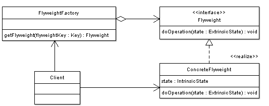

## [享元 (Flyweight)](https://www.oodesign.com/flyweight-pattern.html)

### Motivation

Some programs require a large number of objects that have some shared state among them. Consider for example a game of war, were there is a large number of soldier objects; a soldier object maintain the graphical representation of a soldier, soldier behavior such as motion, and firing weapons, in addition soldier's health and location on the war terrain. Creating a large number of soldier objects is a necessity however it would incur a huge memory cost. Note that although the representation and behavior of a soldier is the same their health and location can vary greatly.

### Intent

利用共享的方式来支持大量细粒度的对象，这些对象一部分内部状态是相同的。

> The intent of this pattern is to use sharing to support a large number of objects that have part of their internal state in common where the other part of state can vary.


### Class Diagram

- Flyweight：享元对象
- IntrinsicState：内部状态，享元对象共享内部状态
- ExtrinsicState：外部状态，每个享元对象的外部状态不同

<div align="center">  </div><br>

- **Flyweight** - Declares an interface through which flyweights can receive and act on extrinsic state.
- **ConcreteFlyweight** - Implements the Flyweight interface and stores intrinsic state. A ConcreteFlyweight object must be sharable. The Concrete flyweight object must maintain state that it is intrinsic to it, and must be able to manipulate state that is extrinsic. In the war game example graphical representation is an intrinsic state, where location and health states are extrinsic. Soldier moves, the motion behavior manipulates the external state (location) to create a new location.
- **FlyweightFactory** - The factory creates and manages flyweight objects. In addition the factory ensures sharing of the flyweight objects. The factory maintains a pool of different flyweight objects and returns an object from the pool if it is already created, adds one to the pool and returns it in case it is new.

    In the war example a Soldier Flyweight factory can create two types of flyweights : a Soldier flyweight, as well as a Colonel Flyweight. When the Client asks the Factory for a soldier, the factory checks to see if there is a soldier in the pool, if there is, it is returned to the client, if there is no soldier in pool, a soldier is created, added to pool, and returned to the client, the next time a client asks for a soldier, the soldier created previously is returned, no new soldier is created.

- **Client** - A client maintains references to flyweights in addition to computing and maintaining extrinsic state

A client needs a flyweight object; it calls the factory to get the flyweight object. The factory checks a pool of flyweights to determine if a flyweight object of the requested type is in the pool, if there is, the reference to that object is returned. If there is no object of the required type, the factory creates a flyweight of the requested type, adds it to the pool, and returns a reference to the flyweight. The flyweight maintains intrinsic state (state that is shared among the large number of objects that we have created the flyweight for) and provides methods to manipulate external state (State that vary from object to object and is not common among the objects we have created the flyweight for).


### Implementation

```java
public interface Flyweight {
    void doOperation(String extrinsicState);
}
```

```java
public class ConcreteFlyweight implements Flyweight {

    private String intrinsicState;

    public ConcreteFlyweight(String intrinsicState) {
        this.intrinsicState = intrinsicState;
    }

    @Override
    public void doOperation(String extrinsicState) {
        System.out.println("Object address: " + System.identityHashCode(this));
        System.out.println("IntrinsicState: " + intrinsicState);
        System.out.println("ExtrinsicState: " + extrinsicState);
    }
}
```

```java
public class FlyweightFactory {

    private HashMap<String, Flyweight> flyweights = new HashMap<>();

    Flyweight getFlyweight(String intrinsicState) {
        if (!flyweights.containsKey(intrinsicState)) {
            Flyweight flyweight = new ConcreteFlyweight(intrinsicState);
            flyweights.put(intrinsicState, flyweight);
        }
        return flyweights.get(intrinsicState);
    }
}
```

```java
public class Client {

    public static void main(String[] args) {
        FlyweightFactory factory = new FlyweightFactory();
        Flyweight flyweight1 = factory.getFlyweight("aa");
        Flyweight flyweight2 = factory.getFlyweight("aa");
        flyweight1.doOperation("x");
        flyweight2.doOperation("y");
    }
}
```

```html
Object address: 1163157884
IntrinsicState: aa
ExtrinsicState: x
Object address: 1163157884
IntrinsicState: aa
ExtrinsicState: y
```

### Example

Text Editors

Object oriented text editors need to create Character Objects to represent each character that is in the document. A Character object maintains information about what is the character, what is its font, what is the size of the character, as well as character location inside the document. A document typically consists of extremely large number of character objects which requires large memory. Note that the number of characters in general (Digits, Letters, Other special characters) is known and is fixed, and the fonts that can be applied to each character are also known, thus by creating a Letter flyweight that maintains Character Type (letter, digit, etc.), as well as font, and by creating a Letter Client object that only maintains each character's location inside the document, we have reduced the editor's memory requirements drastically.


### JDK

Java 利用缓存来加速大量小对象的访问时间。

- java.lang.Integer#valueOf(int)
- java.lang.Boolean#valueOf(boolean)
- java.lang.Byte#valueOf(byte)
- java.lang.Character#valueOf(char)
