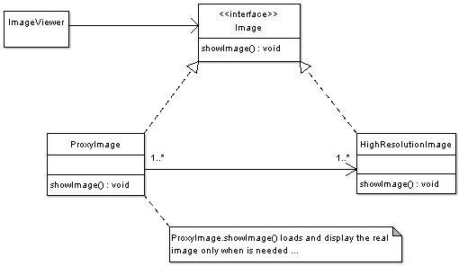

## [代理 (Proxy)](https://www.oodesign.com/proxy-pattern.html)

### Motivation

Sometimes we need the ability to control the access to an object. For example if we need to use only a few methods of some costly objects we'll initialize those objects when we need them entirely. Until that point we can use some light objects exposing the same interface as the heavy objects. These light objects are called proxies and they will instantiate those heavy objects when they are really need and by then we'll use some light objects instead.

This ability to control the access to an object can be required for a variety of reasons: controlling when a costly object needs to be instantiated and initialized, giving different access rights to an object, as well as providing a sophisticated means of accessing and referencing objects running in other processes, on other machines.

Consider for example an image viewer program. An image viewer program must be able to list and display high resolution photo objects that are in a folder, but how often do someone open a folder and view all the images inside. Sometimes you will be looking for a particular photo, sometimes you will only want to see an image name. The image viewer must be able to list all photo objects, but the photo objects must not be loaded into memory until they are required to be rendered.


### Intent

控制对其它对象的访问。

> The intent of this pattern is to provide a "Placeholder" for an object to control references to it.


### Class Diagram

<div align="center">  </div><br>


- **Subject** - Interface implemented by the RealSubject and representing its services. The interface must be implemented by the proxy as well so that the proxy can be used in any location where the RealSubject can be used.
 - **Proxy**
    - Maintains a reference that allows the Proxy to access the RealSubject.
    - Implements the same interface implemented by the RealSubject so that the Proxy can be substituted for the RealSubject.
    - Controls access to the RealSubject and may be responsible for its creation and deletion.
    - Other responsibilities depend on the kind of proxy.
- **RealSubject** - the real object that the proxy represents.

### Description

A client obtains a reference to a Proxy, the client then handles the proxy in the same way it handles RealSubject and thus invoking the method doSomething(). At that point the proxy can do different things prior to invoking RealSubject�s doSomething() method. The client might create a RealSubject object at that point, perform initialization, check permissions of the client to invoke the method, and then invoke the method on the object. The client can also do additional tasks after invoking the doSomething() method, such as incrementing the number of references to the object.


### Applicability & Examples

代理有以下四类：

- 远程代理（Remote Proxy）：控制对远程对象（不同地址空间）的访问，它负责将请求及其参数进行编码，并向不同地址空间中的对象发送已经编码的请求。
- 虚拟代理（Virtual Proxy）：根据需要创建开销很大的对象，它可以缓存实体的附加信息，以便延迟对它的访问，例如在网站加载一个很大图片时，不能马上完成，可以用虚拟代理缓存图片的大小信息，然后生成一张临时图片代替原始图片。
- 保护代理（Protection Proxy）：按权限控制对象的访问，它负责检查调用者是否具有实现一个请求所必须的访问权限。
- 智能代理（Smart Reference）：取代了简单的指针，它在访问对象时执行一些附加操作：记录对象的引用次数；当第一次引用一个对象时，将它装入内存；在访问一个实际对象前，检查是否已经锁定了它，以确保其它对象不能改变它。

- **Virtual Proxies**: delaying the creation and initialization of expensive objects until needed, where the objects are created on demand (For example creating the RealSubject object only when the doSomething method is invoked).
- **Remote Proxies**: providing a local representation for an object that is in a different address space. A common example is Java RMI stub objects. The stub object acts as a proxy where invoking methods on the stub would cause the stub to communicate and invoke methods on a remote object (called skeleton) found on a different machine.
- **Protection Proxies**: where a proxy controls access to RealSubject methods, by giving access to some objects while denying access to others.
- **Smart References**: providing a sophisticated access to certain objects such as tracking the number of references to an object and denying access if a certain number is reached, as well as loading an object from database into memory on demand.


### Implementation

以下是一个虚拟代理的实现，模拟了图片延迟加载的情况下使用与图片大小相等的临时内容去替换原始图片，直到图片加载完成才将图片显示出来。

<div align="center">  </div><br>

```java
package proxy;

/**
 * Subject Interface
 */
public interface Image {

	public void showImage();
	
}

/**
 * Proxy
 */
public class ImageProxy implements Image {

	/**
	 * Private Proxy data 
	 */
	private String imageFilePath;
	
	/**
	 * Reference to RealSubject
	 */
	private Image proxifiedImage;
	
	
	public ImageProxy(String imageFilePath) {
		this.imageFilePath = imageFilePath;	
	}
	
	@Override
	public void showImage() {

		// create the Image Object only when the image is required to be shown
		
		proxifiedImage = new HighResolutionImage(imageFilePath);
		
		// now call showImage on realSubject
		proxifiedImage.showImage();
		
	}

}

/**
 * RealSubject
 */
public class HighResolutionImage implements Image {

	public HighResolutionImage(String imageFilePath) {
		
		loadImage(imageFilePath);
	}

	private void loadImage(String imageFilePath) {

		// load Image from disk into memory
		// this is heavy and costly operation
	}

	@Override
	public void showImage() {

		// Actual Image rendering logic

	}

}

/**
 * Image Viewer program
 */
public class ImageViewer {

	public static void main(String[] args) {
		
	// assuming that the user selects a folder that has 3 images	
	//create the 3 images 	
	Image highResolutionImage1 = new ImageProxy("sample/veryHighResPhoto1.jpeg");
	Image highResolutionImage2 = new ImageProxy("sample/veryHighResPhoto2.jpeg");
	Image highResolutionImage3 = new ImageProxy("sample/veryHighResPhoto3.jpeg");
	
	// assume that the user clicks on Image one item in a list
	// this would cause the program to call showImage() for that image only
	// note that in this case only image one was loaded into memory
	highResolutionImage1.showImage();
	
	// consider using the high resolution image object directly
	Image highResolutionImageNoProxy1 = new HighResolutionImage("sample/veryHighResPhoto1.jpeg");
	Image highResolutionImageNoProxy2 = new HighResolutionImage("sample/veryHighResPhoto2.jpeg");
	Image highResolutionImageBoProxy3 = new HighResolutionImage("sample/veryHighResPhoto3.jpeg");
	
	// assume that the user selects image two item from images list
	highResolutionImageNoProxy2.showImage();
	
	// note that in this case all images have been loaded into memory 
	// and not all have been actually displayed
	// this is a waste of memory resources
	
	}
		
}

```

### Specific problems and implementation

#### Java Remote Method Invocation (RMI)

In java RMI an object on one machine (executing in one JVM) called a client can invoke methods on an object in another machine (another JVM) the second object is called a remote object. The proxy (also called a stub) resides on the client machine and the client invokes the proxy in as if it is invoking the object itself (remember that the proxy implements the same interface that RealSubject implements). The proxy itself will handle communication to the remote object, invoke the method on that remote object, and would return the result if any to the client. The proxy in this case is a Remote proxy.


### JDK

- java.lang.reflect.Proxy
- RMI
