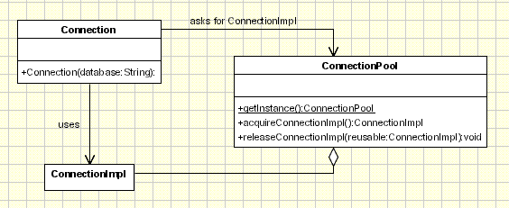

## 6. [Object Pool](https://www.oodesign.com/object-pool-pattern.html)

### Motivation

Performance can be sometimes the key issue during the software development and the object creation(class instantiation) is a costly step. While the Prototype pattern helps in improving the performance by cloning the objects, the Object Pool pattern offer a mechanism to reuse objects that are expensive to create. 

Clients of an object pull "feel" like they are owners of a service although the service is shared among many other clients.

### Intent

> reuse and share objects that are expensive to create.

### Class Diagram

  
 

Implementation involves the following objects:
- **Reusable** - Wraps the limited resource, will be shared by several clients for a limited amount of time.
- **Client** - uses an instance of type Reusable.
- **ReusablePool** - manage the reusable objects for use by Clients, creating and managing a pool of objects.

Here is a sample code for the Prototype pattern:

When a client asks for a Reusable object, the pool performs the following actions:
- Search for an available Reusable object and if it was found it will be returned to the client.
- If no Reusable object was found then it tries to create a new one. If this actions succeeds the new Reusable object will be returned to the client.
- If the pool was unable to create a new Reusable, the pool will wait until a reusable object will be released.

The Client is responsible to request the Reusable object as well to release it to the pool. If this action will not be performed the Reusable object will be lost, being considered unavailable by the ResourcePool.

The clients are not aware that they are sharing the Reusable object. From the client point of view they are the owners of a new object which comes from the Resource pool in the same way that it comes from a factory or another creational design pattern. The only difference is that the Client should mark the Reusable object as available, after it finishes to use it. It's not about releasing the objects; for example if we work with databases, when a connection is closed it's not necessarily destroyed, it means that it can be reused by another client.

### Why to use it?

Basically, we'll use an object pool whenever there are several clients who needs the same stateless resource which is expensive to create.

### Applicability & Examples

Lets' take the example of the database connections. It's obviously that opening too many connections might affect the performance for several reasons:
Creating a connection is an expensive operation.
When there are too many connections opened it takes longer to create a new one and the database server will become overloaded.

Here the object pool comes in to picture to manage the connections and provide a way to reuse and share them. It can also limit the maximum number of objects that can be created.

  
 

#### This pattern provide the following mechanism:

Connection - represent the object which is instantiated by the client. From the client perspective this object is instantiated and it handles the database operations and it is the only object visible to the client. The client is not aware that it uses some shared connections. Internally this class does not contain any code for connecting to the database and calls ConnectionPool.aquireImpl to get a ConnectionImpl object and then delegates the request to ConnectionImpl.

ConnectionImpl is the object which implements the database operations which are exposed by Connection for the client.

ConnectionPool is the main actor to manage the connections to the database. It keeps a list of ConnectionImpl objects and instantiates new objects if this is required.

When the client needs to query the database it instantiate a new Connection object specifying the database name and the call the query method which returns a set of records. From the client point of view this is all.

When the Connection.Query method is called it asks for a ConnectionImpl object from the ConnectionPool. The ConnectionPool tries to find and return an unused object and if it doesn't find it creates one. At this point the maximum number of connections can be limited and if it was reached the pool and wait until one will be available or return null. In the query method the request is delegated to the ConnectionImpl object returned by the object pool. Since the request is just delegated it's recommended to have the same method signature in Connection and ConnectionImpl.

### Specific problems

In building stages for a game that uses a maze and different visual objects that the character encounters it is needed a quick method of generating the haze map using the same objects: wall, door, passage, room... The Prototype pattern is useful in this case because instead of hard coding (using new operation) the room, door, passage and wall objects that get instantiated, CreateMaze method will be parameterized by various prototypical room, door, wall and passage objects, so the composition of the map can be easily changed by replacing the prototypical objects with different ones.

The Client is the CreateMaze method and the ConcretePrototype classes will be the ones creating copies for different objects.

### Specific problems 

Singleton reusable pool - The reusable pool is implemented as a singleton. The reusable pool should be accessible only to the Connection object.

1. Limited number of resources in the pool
2. Handling situations when creating a new resource fails
3. Synchronization
4. Expired resources (unused but still reserved)

### Hot points

- When the Object Pool pattern is used the objects should be marked as available(released) by the client after they are used, so the pool will be aware about this. This is the main drawback because the client should do this and it's a common situation when database connection are not released after they are used. To overcome this a mechanism can be implemented to release resources if they are not used for a period of time.
- Creating the resources might fail and this case should be treated carefully. When there is no available resource(because the number is limited or creating a new one failed) the client should be notified about it.

### JDK

- [java.lang.Object#clone()](http://docs.oracle.com/javase/8/docs/api/java/lang/Object.html#clone%28%29)
