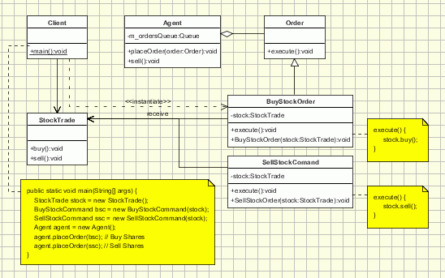

## 2. [命令（Command)](https://www.oodesign.com/command-pattern.html)

### Motivation

“An object that contains a symbol, name or key that represents a list of commands, actions or keystrokes”. This is the definition of a macro, one that should be familiar to any computer user. From this idea the Command design pattern was given birth. 
The Macro represents, at some extent, a command that is built from the reunion of a set of other commands, in a given order. Just as a macro, the Command design pattern encapsulates commands (method calls) in objects allowing us to issue requests without knowing the requested operation or the requesting object. Command design pattern provides the options to queue commands, undo/redo actions and other manipulations.


### Intent

将命令封装成对象中，具有以下作用：

- 使用命令来参数化其它对象
- 将命令放入队列中进行排队
- 将命令的操作记录到日志中
- 支持可撤销的操作

> - encapsulate a request in an object
> - allows the parameterization of clients with different requests
> - allows saving the requests in a queue

### Class Diagram

- Command：命令
- Receiver：命令接收者，也就是命令真正的执行者
- Invoker：通过它来调用命令
- Client：可以设置命令与命令的接收者

- **Command** - declares an interface for executing an operation
- **ConcreteCommand** - extends the Command interface, implementing the Execute method by invoking the corresponding operations on Receiver. It defines a link between the Receiver and the action.
- **Client** - creates a ConcreteCommand object and sets its receiver;
- **Invoker** - asks the command to carry out the request;
- **Receiver** - knows how to perform the operations;

The Client asks for a command to be executed. The Invoker takes the command, encapsulates it and places it in a queue, in case there is something else to do first, and the ConcreteCommand that is in charge of the requested command, sending its result to the Receiver.

<div align="center">  </div><br>

Here is a sample code of a classic implementation of this pattern for placing orders for buying and selling stocks:

<div align="center">  </div><br>

The client creates some orders for buying and selling stocks (ConcreteCommands). Then the orders are sent to the agent (Invoker).The agent takes the orders and place them to the StockTrade system (Receiver). The agent keeps an internal queue with the order to be placed. Let's assume that the StockTrade system is closed each Monday, but the agent accepts orders, and queue them to be processed later on.

````java
public interface Order {
    public abstract void execute ( );
}
// Receiver class.
class StockTrade {
    public void buy() {
        System.out.println("You want to buy stocks");
    }
    public void sell() {
        System.out.println("You want to sell stocks ");
    }
}
// Invoker.
class Agent {
    private m_ordersQueue = new ArrayList();

    public Agent() {
    }
    
    void placeOrder(Order order) {
        ordersQueue.addLast(order);
        order.execute(ordersQueue.getFirstAndRemove());
    }    
}
//ConcreteCommand Class.
class BuyStockOrder implements Order {
    private StockTrade stock;
    public BuyStockOrder ( StockTrade st) {
        stock = st;
    }
    public void execute( ) {
        stock . buy( );
    }
}
//ConcreteCommand Class.
class SellStockOrder implements Order { 
    private StockTrade stock;
    public SellStockOrder ( StockTrade st) {
        stock = st;
    }
    public void execute( ) {
        stock . sell( );
    }
}
// Client
public class Client {
    public static void main(String[] args) {
        StockTrade stock = new StockTrade();
        BuyStockOrder bsc = new BuyStockOrder (stock);
        SellStockOrder ssc = new SellStockOrder (stock);
        Agent agent = new Agent();

        agent.placeOrder(bsc); // Buy Shares
        agent.placeOrder(ssc); // Sell Shares
    }
}
````

### Specific problems and implementation

- The intelligence of a command
    - (Not good) The command is just a link between the receiver and the actions that carry out the request

    - (Not good) The command implements everything itself, without sending anything to the receiver.   

- Undo and redo actions
- Asynchronous Method Invocation
- Adding new commands
- Using composite commands

### Implementation

设计一个遥控器，可以控制电灯开关。

<div align="center">  </div><br>

```java
public interface Command {
    void execute();
}
```

```java
public class LightOnCommand implements Command {
    Light light;

    public LightOnCommand(Light light) {
        this.light = light;
    }

    @Override
    public void execute() {
        light.on();
    }
}
```

```java
public class LightOffCommand implements Command {
    Light light;

    public LightOffCommand(Light light) {
        this.light = light;
    }

    @Override
    public void execute() {
        light.off();
    }
}
```

```java
public class Light {

    public void on() {
        System.out.println("Light is on!");
    }

    public void off() {
        System.out.println("Light is off!");
    }
}
```

```java
/**
 * 遥控器
 */
public class Invoker {
    private Command[] onCommands;
    private Command[] offCommands;
    private final int slotNum = 7;

    public Invoker() {
        this.onCommands = new Command[slotNum];
        this.offCommands = new Command[slotNum];
    }

    public void setOnCommand(Command command, int slot) {
        onCommands[slot] = command;
    }

    public void setOffCommand(Command command, int slot) {
        offCommands[slot] = command;
    }

    public void onButtonWasPushed(int slot) {
        onCommands[slot].execute();
    }

    public void offButtonWasPushed(int slot) {
        offCommands[slot].execute();
    }
}
```

```java
public class Client {
    public static void main(String[] args) {
        Invoker invoker = new Invoker();
        Light light = new Light();
        Command lightOnCommand = new LightOnCommand(light);
        Command lightOffCommand = new LightOffCommand(light);
        invoker.setOnCommand(lightOnCommand, 0);
        invoker.setOffCommand(lightOffCommand, 0);
        invoker.onButtonWasPushed(0);
        invoker.offButtonWasPushed(0);
    }
}
```

### Hot spot

The main advantage of the command design pattern is that it decouples the object that invokes the operation from the one that know how to perform it. And this advantage must be kept. There are implementations of this design pattern in which the invoker is aware of the concrete commands classes. This is wrong making the implementation more tightly coupled. The invoker should be aware only about the abstract command class.


### JDK

- [java.lang.Runnable](http://docs.oracle.com/javase/8/docs/api/java/lang/Runnable.html)
- [Netflix Hystrix](https://github.com/Netflix/Hystrix/wiki)
- [javax.swing.Action](http://docs.oracle.com/javase/8/docs/api/javax/swing/Action.html)
