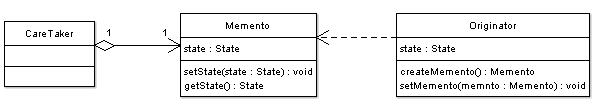
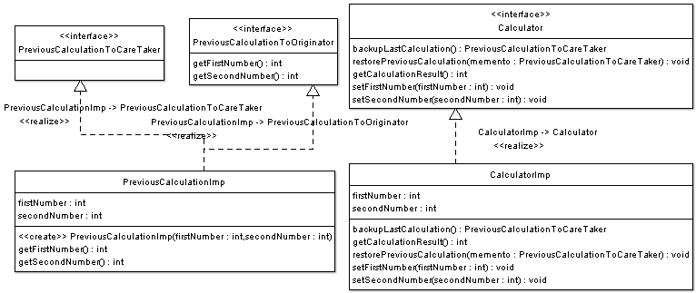

## [备忘录 (Memento)](https://www.oodesign.com/memento-pattern.html)

### Motivation

It is sometimes necessary to capture the internal state of an object at some point and have the ability to restore the object to that state later in time. Such a case is useful in case of error or failure. Consider the case of a calculator object with an undo operation such a calculator could simply maintain a list of all previous operation that it has performed and thus would be able to restore a previous calculation it has performed. This would cause the calculator object to become larger, more complex, and heavyweight, as the calculator object would have to provide additional undo functionality and should maintain a list of all previous operations. This functionality can be moved out of the calculator class, so that an external (let's call it undo manager class) can collect the internal state of the calculator and save it. However providing the explicit access to every state variable of the calculator to the restore manager would be impractical and would violate the encapsulation principle.


### Intent

在不违反封装的情况下获得对象的内部状态，从而在需要时可以将对象恢复到最初状态。

> The intent of this pattern is to capture the internal state of an object without violating encapsulation and thus providing a mean for restoring the object into initial state when needed.

### Class Diagram

- Originator：原始对象
- Caretaker：负责保存好备忘录
- Memento：备忘录，存储原始对象的状态。备忘录实际上有两个接口，一个是提供给 Caretaker 的窄接口：它只能将备忘录传递给其它对象；一个是提供给 Originator 的宽接口，允许它访问到先前状态所需的所有数据。理想情况是只允许 Originator 访问本备忘录的内部状态。

- Memento
    - Stores internal state of the Originator object. The state can include any number of state variables.
    - The Memento must have two interfaces, an interface to the caretaker. This interface must not allow any operations or any access to internal state stored by the memento and thus honors encapsulation. The other interface is to the originator and allows the originator to access any state variables necessary to for the originator to restore previous state.
- Originator
    - Creates a memento object capturing the originators internal state.
    - Use the memento object to restore its previous state.
- Caretaker
    - Responsible for keeping the memento.
    - The memento is opaque to the caretaker, and the caretaker must not operate on it.

<div align="center">  </div><br>

A Caretaker would like to perform an operation on the Originator while having the possibility to rollback. The caretaker calls the createMemento() method on the originator asking the originator to pass it a memento object. At this point the originator creates a memento object saving its internal state and passes the memento to the caretaker. The caretaker maintains the memento object and performs the operation. In case of the need to undo the operation, the caretaker calls the setMemento() method on the originator passing the maintained memento object. The originator would accept the memento, using it to restore its previous state.


### Implementation

以下实现了一个简单计算器程序，可以输入两个值，然后计算这两个值的和。备忘录模式允许将这两个值存储起来，然后在某个时刻用存储的状态进行恢复。

<div align="center">  </div><br>

实现参考：[Memento Pattern - Calculator Example - Java Sourcecode](https://www.oodesign.com/memento-pattern-calculator-example-java-sourcecode.html)

```java
/**
 * Originator Interface
 */
public interface Calculator {

    // Create Memento
    PreviousCalculationToCareTaker backupLastCalculation();

    // setMemento
    void restorePreviousCalculation(PreviousCalculationToCareTaker memento);

    int getCalculationResult();

    void setFirstNumber(int firstNumber);

    void setSecondNumber(int secondNumber);
}
```

```java
/**
 * Originator Implementation
 */
public class CalculatorImp implements Calculator {

    private int firstNumber;
    private int secondNumber;

    @Override
    public PreviousCalculationToCareTaker backupLastCalculation() {
        // create a memento object used for restoring two numbers
        return new PreviousCalculationImp(firstNumber, secondNumber);
    }

    @Override
    public void restorePreviousCalculation(PreviousCalculationToCareTaker memento) {
        this.firstNumber = ((PreviousCalculationToOriginator) memento).getFirstNumber();
        this.secondNumber = ((PreviousCalculationToOriginator) memento).getSecondNumber();
    }

    @Override
    public int getCalculationResult() {
        // result is adding two numbers
        return firstNumber + secondNumber;
    }

    @Override
    public void setFirstNumber(int firstNumber) {
        this.firstNumber = firstNumber;
    }

    @Override
    public void setSecondNumber(int secondNumber) {
        this.secondNumber = secondNumber;
    }
}
```

```java
/**
 * Memento Interface to Originator
 *
 * This interface allows the originator to restore its state
 */
public interface PreviousCalculationToOriginator {
    int getFirstNumber();
    int getSecondNumber();
}
```

```java
/**
 *  Memento interface to CalculatorOperator (Caretaker)
 */
public interface PreviousCalculationToCareTaker {
    // no operations permitted for the caretaker
}
```

```java
/**
 * Memento Object Implementation
 * <p>
 * Note that this object implements both interfaces to Originator and CareTaker
 */
public class PreviousCalculationImp implements PreviousCalculationToCareTaker,
        PreviousCalculationToOriginator {

    private int firstNumber;
    private int secondNumber;

    public PreviousCalculationImp(int firstNumber, int secondNumber) {
        this.firstNumber = firstNumber;
        this.secondNumber = secondNumber;
    }

    @Override
    public int getFirstNumber() {
        return firstNumber;
    }

    @Override
    public int getSecondNumber() {
        return secondNumber;
    }
}
```

```java
/**
 * CareTaker object
 */
public class Client {

    public static void main(String[] args) {
        // program starts
        Calculator calculator = new CalculatorImp();

        // assume user enters two numbers
        calculator.setFirstNumber(10);
        calculator.setSecondNumber(100);

        // find result
        System.out.println(calculator.getCalculationResult());

        // Store result of this calculation in case of error
        PreviousCalculationToCareTaker memento = calculator.backupLastCalculation();

        // user enters a number
        calculator.setFirstNumber(17);

        // user enters a wrong second number and calculates result
        calculator.setSecondNumber(-290);

        // calculate result
        System.out.println(calculator.getCalculationResult());

        // user hits CTRL + Z to undo last operation and see last result
        calculator.restorePreviousCalculation(memento);

        // result restored
        System.out.println(calculator.getCalculationResult());
    }
}
```

```html
110
-273
110
```

### Specific problems and implementation

#### Database Transactions

Transactions are operations on the database that occur in an atomic, consistent, durable, and isolated fashion. A transaction can contain multiple operations on the database; each operation can succeed or fail, however a transaction guarantees that if all operations succeed, the transaction would commit and would be final. And if any operation fails, then the transaction would fail and all operations would rollback and leave the database as if nothing has happened.

This mechanism of rolling back uses the memento design pattern. Consider an object representing a database table, a transaction manager object which is responsible of performing transactions must perform operations on the table object while having the ability to undo the operation if it fails, or if any operation on any other table object fails. To be able to rollback, the transaction manager object would ask the table object for a memento before performing an operation and thus in case of failure, the memento object would be used to restore the table to its previous state.

#### Consequences

Memento protects encapsulation and avoids exposing originator's internal state and implementation. It also simplifies originator code such that the originator does not need to keep track of its previous state since this is the responsibility of the CareTaker.

Using the memento pattern can be expensive depending on the amount of state information that has to be stored inside the memento object. In addition the caretaker must contain additional logic to be able to manage mementos.

#### Related Patterns

**Command Pattern** - Commands can use mementos to maintain state for undoable operations.


#### Known Uses

- Undo and restore operations in most software.

- Database transactions discussed earlier.


### JDK

- java.io.Serializable
