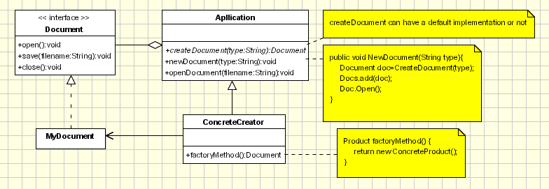

## [工厂方法（Factory Method](https://www.oodesign.com/factory-method-pattern.html)

### Motivation

Also known as Virtual Constructor, the Factory Method is related to the idea on which libraries work: a library uses abstract classes for defining and maintaining relations between objects. One type of responsibility is creating such objects. The library knows when an object needs to be created, but not what kind of object it should create, this being specific to the application using the library.

The Factory method works just the same way: it defines an interface for creating an object, but leaves the choice of its type to the subclasses, creation being deferred at run-time. A simple real life example of the Factory Method is the hotel. When staying in a hotel you first have to check in. The person working at the front desk will give you a key to your room after you've paid for the room you want and this way he can be looked at as a "room" factory. While staying at the hotel, you might need to make a phone call, so you call the front desk and the person there will connect you with the number you need, becoming a "phone-call" factory, because he controls the access to calls, too.


### Intent

> 定义了一个创建对象的接口，但由子类决定要实例化哪个类。工厂方法把实例化操作推迟到子类。

> Defines an interface for creating objects, but let subclasses to decide which class to instantiate
> Refers to the newly created object through a common interface


### Class Diagram

在简单工厂中，创建对象的是另一个类，而在工厂方法中，是由子类来创建对象。

<div align="center">  </div><br>

The participants classes in this pattern are:
- **Product** defines the interface for objects the factory method creates.
- **ConcreteProduct** implements the Product interface.
- **Creator**(also refered as **Factory** because it creates the Product objects) declares the method **FactoryMethod**, which returns a Product object. May call the generating method for creating Product objects
- **ConcreteCreator** or **ConcereteFactory** overrides the generating method for creating ConcreteProduct objects

All concrete products are subclasses of the Product class, so all of them have the same basic implementation, at some extent. The Creator class specifies all standard and generic behavior of the products and when a new product is needed, it sends the creation details that are supplied by the client to the ConcreteCreator. Having this diagram in mind, it is easy for us now to produce the code related to it. Here is how the implementation of the classic Factory method should look:

````java
public abstract class Creator 
{
	public void anOperation() 
	{
		Product product = factoryMethod();
	}
	protected abstract Product factoryMethod();
}

public class ConcreteCreator extends Creator 
{
	protected Product factoryMethod() 
	{
		return new ConcreteProduct();
	}
}

public class Client 
{
	public static void main( String arg[] ) 
	{
		Creator creator = new ConcreteCreator();
		creator.anOperation();
	}
}
````

### Implementation

下图中，Factory 有一个 doSomething() 方法，这个方法需要用到一个产品对象，这个产品对象由 factoryMethod() 方法创建。该方法是抽象的，需要由子类去实现。

```java
public abstract class Factory {
    abstract public Product factoryMethod();
    public void doSomething() {
        Product product = factoryMethod();
        // do something with the product
    }
}

public class ConcreteFactory extends Factory {
    public Product factoryMethod() {
        return new ConcreteProduct();
    }
}

public class ConcreteFactory1 extends Factory {
    public Product factoryMethod() {
        return new ConcreteProduct1();
    }
}

public class ConcreteFactory2 extends Factory {
    public Product factoryMethod() {
        return new ConcreteProduct2();
    }
}
```

### Applicability & Examples

The need for implementing the Factory Method is very frequent. The cases are the ones below:
- when a class can't anticipate the type of the objects it is supposed to create
- when a class wants its subclasses to be the ones to specific the type of a newly created object

#### Example 1 - Documents Application

Take into consideration a framework for desktop applications. Such applications are meant to work with documents. A framework for desktop applications contains definitions for operations such as opening, creating and saving a document. The basic classes are abstract ones, named Application and Document, their clients having to create subclasses from them in order to define their own applications. For generating a drawing application, for example, they need to define the DrawingApplication and DrawingDocument classes. The Application class has the task of managing the documents, taking action at the request of the client (for example, when the user selects the open or save command form the menu).

Because the Document class that needs to be instantiated is specific to the application, the Application class does not know it in advance, so it doesn't know what to instantiate, but it does know when to instantiate it. The framework needs to instantiate a certain class, but it only knows abstract classes that can't be instantiated.

The Factory Method design pattern solves the problem by putting all the information related to the class that needs to be instantiated into an object and using them outside the framework, as you can see below

<div align="center">  </div><br>

In the Application class the CreateDocument method either has a default implementation or it doesn't have any implementation at all, this operation being redefined in the MyApplication subclass so that it creates a MyDocument object and returns a reference to it.

````java
public Document CreateDocument(String type){
	if (type.isEqual("html"))
		return new HtmlDocument();
	if (type.isEqual("proprietary"))
		return new MyDocument();
	if (type.isEqual("pdf"))
		return new PdfDocument ();
}
````

Assuming that the Application class has a member called docs that represents a list of documents being handled by the application, then the NewDocument method should look like this:

````java
public void NewDocument(String type){
	Document doc=CreateDocument(type);
	Docs.add(doc);
	Doc.Open();
}
````
This method will be inherited by the MyApplication class and, so, through the CreateDocument method, it will actually instantiate MyDocument objects. We will call the CreateDocument method a Factory Method because it is responsible with 'making' an object. Through this method, redefined in Application's subclasses, we can actually shape the situation in which the Application class creates objects without knowing their type. From this point of view the factory method is pattern which provides us a way to achieve the DIP principle.

### Drawbacks and Benefits

Here are the benefits and drawbacks of factory method pattern:

- \+ The main reason for which the factory pattern is used is that it introduces a separation between the application and a family of classes (it introduces weak coupling instead of tight coupling hiding concrete classes from the application). It provides a simple way of extending the family of products with minor changes in application code.
- \+ It provides customization hooks. When the objects are created directly inside the class it's hard to replace them by objects which extend their functionality. If a factory is used instead to create a family of objects the customized objects can easily replace the original objects, configuring the factory to create them.
- \- The factory has to be used for a family of objects. If the classes doesn't extend common base class or interface they can not be used in a factory design template.


### JDK

- [java.util.Calendar](http://docs.oracle.com/javase/8/docs/api/java/util/Calendar.html#getInstance--)
- [java.util.ResourceBundle](http://docs.oracle.com/javase/8/docs/api/java/util/ResourceBundle.html#getBundle-java.lang.String-)
- [java.text.NumberFormat](http://docs.oracle.com/javase/8/docs/api/java/text/NumberFormat.html#getInstance--)
- [java.nio.charset.Charset](http://docs.oracle.com/javase/8/docs/api/java/nio/charset/Charset.html#forName-java.lang.String-)
- [java.net.URLStreamHandlerFactory](http://docs.oracle.com/javase/8/docs/api/java/net/URLStreamHandlerFactory.html#createURLStreamHandler-java.lang.String-)
- [java.util.EnumSet](https://docs.oracle.com/javase/8/docs/api/java/util/EnumSet.html#of-E-)
- [javax.xml.bind.JAXBContext](https://docs.oracle.com/javase/8/docs/api/javax/xml/bind/JAXBContext.html#createMarshaller--)
