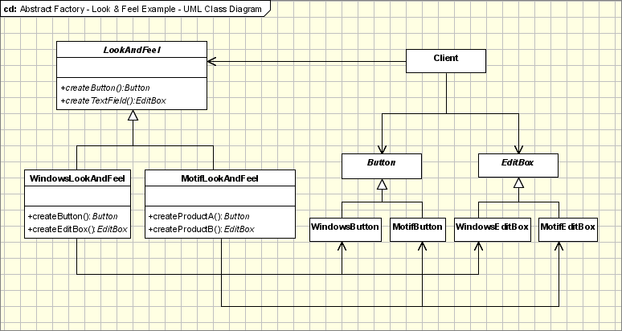

## 4. [抽象工厂（Abstract Factory](https://www.oodesign.com/abstract-factory-pattern.html)

### Motivation

Modularization is a big issue in today's programming. Programmers all over the world are trying to avoid the idea of adding code to existing classes in order to make them support encapsulating more general information. Take the case of a information manager which manages phone number. Phone numbers have a particular rule on which they get generated depending on areas and countries. If at some point the application should be changed in order to support adding numbers form a new country, the code of the application would have to be changed and it would become more and more complicated.

In order to prevent it, the Abstract Factory design pattern is used. Using this pattern a framework is defined, which produces objects that follow a general pattern and at runtime this factory is paired with any concrete factory to produce objects that follow the pattern of a certain country. In other words, the Abstract Factory is a super-factory which creates other factories (Factory of factories).


### Intent

提供一个接口，用于创建   **相关的对象家族**  。

> Abstract Factory offers the interface for creating a family of related objects, without explicitly specifying their classes.

### Class Diagram

抽象工厂模式创建的是对象家族，也就是很多对象而不是一个对象，并且这些对象是相关的，也就是说必须一起创建出来。而工厂方法模式只是用于创建一个对象，这和抽象工厂模式有很大不同。

抽象工厂模式用到了工厂方法模式来创建单一对象，AbstractFactory 中的 createProductA() 和 createProductB() 方法都是让子类来实现，这两个方法单独来看就是在创建一个对象，这符合工厂方法模式的定义。

至于创建对象的家族这一概念是在 Client 体现，Client 要通过 AbstractFactory 同时调用两个方法来创建出两个对象，在这里这两个对象就有很大的相关性，Client 需要同时创建出这两个对象。

从高层次来看，抽象工厂使用了组合，即 Cilent 组合了 AbstractFactory，而工厂方法模式使用了继承。

<div align="center">  </div><br>

The classes that participate to the Abstract Factory pattern are:

- **AbstractFactory** - declares a interface for operations that create abstract products.

- **ConcreteFactory** - implements operations to create concrete products.

- **AbstractProduct** - declares an interface for a type of product objects.

- **Product** - defines a product to be created by the corresponding ConcreteFactory; it implements the AbstractProduct interface.

- **Client** - uses the interfaces declared by the AbstractFactory and AbstractProduct classes.

The AbstractFactory class is the one that determines the actual type of the concrete object and creates it, but it returns an abstract pointer to the concrete object just created. This determines the behavior of the client that asks the factory to create an object of a certain abstract type and to return the abstract pointer to it, keeping the client from knowing anything about the actual creation of the object.

The fact that the factory returns an abstract pointer to the created object means that the client doesn't have knowledge of the object's type. This implies that there is no need for including any class declarations relating to the concrete type, the client dealing at all times with the abstract type. The objects of the concrete type, created by the factory, are accessed by the client only through the abstract interface.

### Implementation

```java
public class AbstractProductA {
}

public class AbstractProductB {
}

public class ProductA1 extends AbstractProductA {
}

public class ProductA2 extends AbstractProductA {
}

public class ProductB1 extends AbstractProductB {
}

public class ProductB2 extends AbstractProductB {
}

public abstract class AbstractFactory {
    abstract AbstractProductA createProductA();
    abstract AbstractProductB createProductB();
}

public class ConcreteFactory1 extends AbstractFactory {
    AbstractProductA createProductA() {
        return new ProductA1();
    }

    AbstractProductB createProductB() {
        return new ProductB1();
    }
}

public class ConcreteFactory2 extends AbstractFactory {
    AbstractProductA createProductA() {
        return new ProductA2();
    }

    AbstractProductB createProductB() {
        return new ProductB2();
    }
}

public class Client {
    public static void main(String[] args) {
        AbstractFactory abstractFactory = new ConcreteFactory1();
        AbstractProductA productA = abstractFactory.createProductA();
        AbstractProductB productB = abstractFactory.createProductB();
        // do something with productA and productB
    }
}
```

The classic implementation for the Abstract Factory pattern is the following:

````java
abstract class AbstractProductA {
    public abstract void operationA1();
	public abstract void operationA2();
}
class ProductA1 extends AbstractProductA{
	ProductA1(String arg){
		System.out.println("Hello "+arg);
	} // Implement the code here
	public void operationA1() { };
	public void operationA2() { };
}
class ProductA2 extends AbstractProductA{
	ProductA2(String arg){
		System.out.println("Hello "+arg);
	} // Implement the code here
	public void operationA1() { };
	public void operationA2() { };
}
abstract class AbstractProductB{
	//public abstract void operationB1();
	//public abstract void operationB2();
}
class ProductB1 extends AbstractProductB{
	ProductB1(String arg){
		System.out.println("Hello "+arg);
	} // Implement the code here
}
class ProductB2 extends AbstractProductB{
	ProductB2(String arg){
		System.out.println("Hello "+arg);
	} // Implement the code here
}
abstract class AbstractFactory{
	abstract AbstractProductA createProductA();
	abstract AbstractProductB createProductB();
}
class ConcreteFactory1 extends AbstractFactory{
	AbstractProductA createProductA(){
		return new ProductA1("ProductA1");
	}
	AbstractProductB createProductB(){
		return new ProductB1("ProductB1");
	}
}
class ConcreteFactory2 extends AbstractFactory{
	AbstractProductA createProductA(){
		return new ProductA2("ProductA2");
	}
	AbstractProductB createProductB(){
		return new ProductB2("ProductB2");
	}
}
//Factory creator - an indirect way of instantiating the factories
class FactoryMaker{
	private static AbstractFactory pf=null;
	static AbstractFactory getFactory(String choice){
		if(choice.equals("a")){
			pf=new ConcreteFactory1();
		}else if(choice.equals("b")){
				pf=new ConcreteFactory2();
			} return pf;
	}
}
// Client
public class Client{
	public static void main(String args[]){
		AbstractFactory pf=FactoryMaker.getFactory("a");
		AbstractProductA product=pf.createProductA();
		//more function calls on product
	}
}
````

### Applicability & Examples

We should use the Abstract Factory design pattern when:
- the system needs to be independent from the way the products it works with are created.
- the system is or should be configured to work with multiple families of products.
- a family of products is designed to work only all together.
- the creation of a library of products is needed, for which is relevant only the interface, not the implementation, too.

#### Phone Number Example

The example at the beginning of the article can be extended to addresses, too. The AbstractFactory class will contain methods for creating a new entry in the information manager for a phone number and for an address, methods that produce the abstract products Address and PhoneNumber, which belong to AbstractProduct classes. The AbstractProduct classes will define methods that these products support: for the address get and set methods for the street, city, region and postal code members and for the phone number get and set methods for the number.

The ConcreteFactory and ConcreteProduct classes will implement the interfaces defined above and will appear in our example in the form of the USAddressFactory class and the USAddress and USPhoneNumber classes. For each new country that needs to be added to the application, a new set of concrete-type classes will be added. This way we can have the EnglandAddressFactory and the EnglandAddress and EnglandPhoneNumber that are files for English address information.

#### Look & Feel Example

Look & Feel Abstract Factory is the most common example. For example, a GUI framework should support several look and feel themes, such as Motif and Windows look. Each style defines different looks and behaviors for each type of controls: Buttons and Edit Boxes. In order to avoid the hardociding it for each type of control we define an abstract class **LookAndFeel**. This calls will instantiate, depending on a configuration parameter in the application one of the concrete factories: **WindowsLookAndFeel** or **MotifLookAndFeel**. Each request for a new object will be delegated to the instantiated concrete factory which will return the controls with the specific flavor

<div align="center">  </div><br>

Hot Points:

- AbstractFactory class declares only an interface for creating the products. The actual creation is the task of the ConcreteProduct classes, where a good approach is applying the Factory Method design pattern for each product of the family.

- Extending factories can be done by using one Create method for all products and attaching information about the type of product needed.


### JDK

- [javax.xml.parsers.DocumentBuilderFactory](http://docs.oracle.com/javase/8/docs/api/javax/xml/parsers/DocumentBuilderFactory.html)
- [javax.xml.transform.TransformerFactory](http://docs.oracle.com/javase/8/docs/api/javax/xml/transform/TransformerFactory.html#newInstance--)
- [javax.xml.xpath.XPathFactory](http://docs.oracle.com/javase/8/docs/api/javax/xml/xpath/XPathFactory.html#newInstance--)
