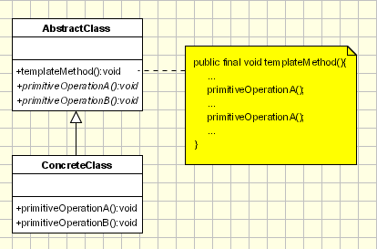

## [模板方法 (Template Method)](https://www.oodesign.com/template-method-pattern.html )


### Motivation

If we take a look at the dictionary definition of a template we can see that a template is a preset format, used as a starting point for a particular application so that the format does not have to be recreated each time it is used.
On the same idea is the template method is based. A template method defines an algorithm in a base class using abstract operations that subclasses override to provide concrete behavior.


### Intent

定义算法框架，并将一些步骤的实现延迟到子类。

通过模板方法，子类可以重新定义算法的某些步骤，而不用改变算法的结构。

> - Define the skeleton of an algorithm in an operation, deferring some steps to subclasses.
> - Template Method lets subclasses redefine certain steps of an algorithm without letting them to change the algorithm's structure.


### Class Diagram

<div align="center">  </div><br>


**AbstractClass** 
- defines abstract primitive operations that concrete subclasses define to implement steps of an algorithm.
- implements a template method which defines the skeleton of an algorithm. The template method calls primitive operations as well as operations defined in AbstractClass or those of other objects.

**ConcreteClass** 
- implements the primitive operations to carry out subclass-specific steps of the algorithm.

When a concrete class is called the template method code will be executed from the base class while for each method used inside the template method will be called the implementation from the derived class.

### Applicability

The Template Method pattern should be used:
- to implement the invariant parts of an algorithm once and leave it up to subclasses to implement the behavior that can vary.
- when refactoring is performed and common behavior is identified among classes. A abstract base class containing all the common code (in the template method) should be created to avoid code duplication.


### Implementation

冲咖啡和冲茶都有类似的流程，但是某些步骤会有点不一样，要求复用那些相同步骤的代码。

<div align="center">  </div><br>

```java
public abstract class CaffeineBeverage {

    final void prepareRecipe() {
        boilWater();
        brew();
        pourInCup();
        addCondiments();
    }

    public abstract void brew();

    public abstract void addCondiments();

    public void boilWater() {
        System.out.println("boilWater");
    }

    public void pourInCup() {
        System.out.println("pourInCup");
    }
}
```

```java
public class Coffee extends CaffeineBeverage {

    public void brew() {
        System.out.println("Coffee.brew");
    }

    public void addCondiments() {
        System.out.println("Coffee.addCondiments");
    }
}
```

```java
public class Tea extends CaffeineBeverage {

    public void brew() {
        System.out.println("Tea.brew");
    }


    public void addCondiments() {
        System.out.println("Tea.addCondiments");
    }
}
```

```java
public class Client {
    public static void main(String[] args) {
        CaffeineBeverage caffeineBeverage = new Coffee();
        caffeineBeverage.prepareRecipe();
        System.out.println("-----------");
        caffeineBeverage = new Tea();
        caffeineBeverage.prepareRecipe();
    }
}
```

```html
boilWater
Coffee.brew
pourInCup
Coffee.addCondiments
-----------
boilWater
Tea.brew
pourInCup
Tea.addCondiments
```


### JDK

- java.util.Collections#sort()
- java.io.InputStream#skip()
- java.io.InputStream#read()
- java.util.AbstractList#indexOf()
