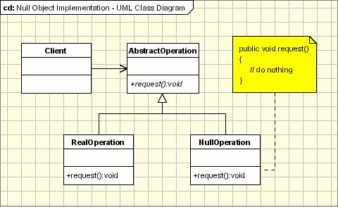

## [空对象 (Null Object Pattern)](https://www.oodesign.com/null-object-pattern.html)


### Motivation

There are some cases when a system has to use some functionality and some cases when it doesn't. Let's say we have to implement a class that should send the results to a log file or to the console. But this is just an additional option and the data is logged depending on the configuration values.

 

If there are cases when the client module does not have to log any data then it has to check the configuration parameter in and if block and then to call or not the Logger class. But as we know the 'if' block is not an elegant solution.


### Intent

使用什么都不做的空对象来代替 NULL。

一个方法返回 NULL，意味着方法的调用端需要去检查返回值是否是 NULL，这么做会导致非常多的冗余的检查代码。并且如果某一个调用端忘记了做这个检查返回值，而直接使用返回的对象，那么就有可能抛出空指针异常。

> - Provide an object as a surrogate for the lack of an object of a given type.
> - The Null Object Pattern provides intelligent do nothing behavior, hiding the details from its collaborators.


### Class Diagram

<div align="center">  </div><br>

- **AbstractClass** - defines abstract primitive operations that concrete implementations have to define.
- **RealClass** - a real implementation of the AbstractClass performing some real actions.
- **NullClass** - an implementation which do nothing of the abstract class, in order to provide a non-null object to the client.
- **Client** - the client gets an implementation of the abstract class and uses it. It doesn't really care if the implementation is a null object or an real object since both of them are used in the same way.


### Implementation

```java
public abstract class AbstractOperation {
    abstract void request();
}
```

```java
public class RealOperation extends AbstractOperation {
    @Override
    void request() {
        System.out.println("do something");
    }
}
```

```java
public class NullOperation extends AbstractOperation{
    @Override
    void request() {
        // do nothing
    }
}
```

```java
public class Client {
    public static void main(String[] args) {
        AbstractOperation abstractOperation = func(-1);
        abstractOperation.request();
    }

    public static AbstractOperation func(int para) {
        if (para < 0) {
            return new NullOperation();
        }
        return new RealOperation();
    }
}
```

### Specific problems and implementation

- Null Object and Factory
- Null Object and Template Method
- Removing old functionality

### Conclusion

The Null Object Pattern is used to avoid special if blocks for do nothing code, by putting the “do nothing” code in the Null Object which becomes responsible for doing nothing. The client is not aware anymore if the real object or the null object is called so the 'if' section is removed from client implementation.