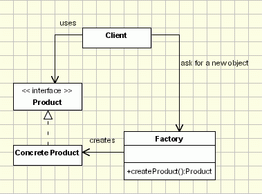

## [简单工厂（Simple Factory](https://www.oodesign.com/factory-pattern.html)


### Intent

在创建一个对象时不向客户暴露内部细节，并提供一个创建对象的通用接口。

- creates objects without exposing the instantiation logic to the client.
- refers to the newly created object through a common interface

### Class Diagram

简单工厂把实例化的操作单独放到一个类中，这个类就成为简单工厂类，让简单工厂类来决定应该用哪个具体子类来实例化。

这样做能把客户类和具体子类的实现解耦，客户类不再需要知道有哪些子类以及应当实例化哪个子类。客户类往往有多个，如果不使用简单工厂，那么所有的客户类都要知道所有子类的细节。而且一旦子类发生改变，例如增加子类，那么所有的客户类都要进行修改。

<div align="center">  </div><br>

The implementation is really simple
- The client needs a product, but instead of creating it directly using the new operator, it asks the factory object for a new product, providing the information about the type of object it needs.
- The factory instantiates a new concrete product and then returns to the client the newly created product(casted to abstract product class).
- The client uses the products as abstract products without being aware about their concrete implementation.


### Implementation

```java
public interface Product {
}

public class ConcreteProduct implements Product {
}

public class ConcreteProduct1 implements Product {
}

public class ConcreteProduct2 implements Product {
}
```

以下的 Client 类包含了实例化的代码，这是一种错误的实现。如果在客户类中存在这种实例化代码，就需要考虑将代码放到简单工厂中。

```java
public class Client {

    public static void main(String[] args) {
        int type = 1;
        Product product;
        if (type == 1) {
            product = new ConcreteProduct1();
        } else if (type == 2) {
            product = new ConcreteProduct2();
        } else {
            product = new ConcreteProduct();
        }
        // do something with the product
    }
}
```

以下的 SimpleFactory 是简单工厂实现，它被所有需要进行实例化的客户类调用。

```java
public class SimpleFactory {

    public Product createProduct(int type) {
        if (type == 1) {
            return new ConcreteProduct1();
        } else if (type == 2) {
            return new ConcreteProduct2();
        }
        return new ConcreteProduct();
    }
}
```

```java
public class Client {

    public static void main(String[] args) {
        SimpleFactory simpleFactory = new SimpleFactory();
        Product product = simpleFactory.createProduct(1);
        // do something with the product
    }
}
```

### Applicability & Examples

Probably the factory pattern is one of the most used patterns.

For example a graphical application works with shapes. In our implementation the drawing framework is the client and the shapes are the products. All the shapes are derived from an abstract shape class (or interface). The Shape class defines the draw and move operations which must be implemented by the concrete shapes. Let's assume a command is selected from the menu to create a new Circle. The framework receives the shape type as a string parameter, it asks the factory to create a new shape sending the parameter received from menu. The factory creates a new circle and returns it to the framework, casted to an abstract shape. Then the framework uses the object as casted to the abstract class without being aware of the concrete object type.

The advantage is obvious: New shapes can be added without changing a single line of code in the framework(the client code that uses the shapes from the factory). As it is shown in the next sections, there are certain factory implementations that allow adding new products without even modifying the factory class.

### Specific problems and implementation

#### Procedural Solution - switch/case noob instantiation.

<div align="center">  </div><br>

Those are also known as parameterized Factories. The generating method can be written so that it can generate more types of Product objects, using a condition (entered as a method parameter or read from some global configuration parameters - see abstract factory pattern) to identify the type of the object that should be created, as below:

````java
public class ProductFactory{
	public Product createProduct(String ProductID){
		if (id==ID1)
			return new OneProduct();
		if (id==ID2) return
			return new AnotherProduct();
		... // so on for the other Ids
		
        return null; //if the id doesn't have any of the expected values
    }
    ...
}
````
This implementation is the most simple and intuitive (Let's call it noob implementation). The problem here is that once we add a new concrete product call we should modify the Factory class. It is not very flexible and it violates open close principle. Of course we can subclass the factory class, but let's not forget that the factory class is usually used as a singleton. Subclassing it means replacing all the factory class references everywhere through the code.
