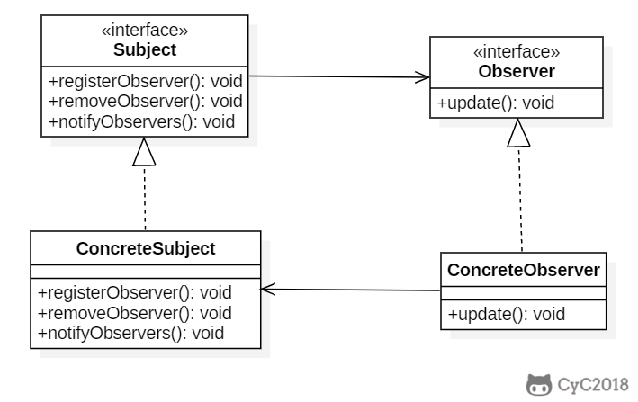
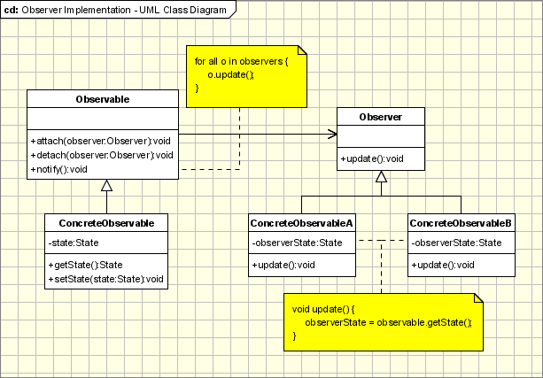

## 7. [观察者 (Observer Pattern)](https://www.oodesign.com/observer-pattern.html)

### Motivation

We can not talk about Object Oriented Programming without considering the state of the objects. After all object oriented programming is about objects and their interaction. The cases when certain objects need to be informed about the changes occurred in other objects are frequent. To have a good design means to decouple as much as possible and to reduce the dependencies. The Observer Design Pattern can be used whenever a subject has to be observed by one or more observers.

Let's assume we have a stock system which provides data for several types of client. We want to have a client implemented as a web based application but in near future we need to add clients for mobile devices, Palm or Pocket PC, or to have a system to notify the users with sms alerts. Now it's simple to see what we need from the observer pattern: we need to separate the subject(stocks server) from it's observers(client applications) in such a way that adding new observer will be transparent for the server.

### Intent

定义对象之间的一对多依赖，当一个对象状态改变时，它的所有依赖都会收到通知并且自动更新状态。

> Defines a one-to-many dependency between objects so that when one object changes state, all its dependents are notified and updated automatically.

主题（Subject）是被观察的对象，而其所有依赖者（Observer）称为观察者。

<div align="center">  </div><br>

### Class Diagram

主题（Subject）具有注册和移除观察者、并通知所有观察者的功能，主题是通过维护一张观察者列表来实现这些操作的。

观察者（Observer）的注册功能需要调用主题的 registerObserver() 方法。

<div align="center">  </div><br>


<div align="center">  </div><br>

The participants classes in this pattern are:
- **Observable** - interface or abstract class defining the operations for attaching and de-attaching observers to the client. In the GOF book this class/interface is known as Subject.
- **ConcreteObservable** - concrete Observable class. It maintain the state of the object and when a change in the state occurs it notifies the attached Observers.
- **Observer** - interface or abstract class defining the operations to be used to notify this object.
- **ConcreteObserverA, ConcreteObserver2** - concrete **Observer** implementations.

The flow is simple: the main framework instantiate the ConcreteObservable object. Then it instantiate and attaches the concrete observers to it using the methods defined in the Observable interface. Each time the state of the subject it's changing it notifies all the attached Observers using the methods defined in the Observer interface. When a new Observer is added to the application, all we need to do is to instantiate it in the main framework and to add attach it to the Observable object. The classes already created will remain unchanged.

### Implementation

天气数据布告板会在天气信息发生改变时更新其内容，布告板有多个，并且在将来会继续增加。

<div align="center">  </div><br>

```java
public interface Subject {
    void registerObserver(Observer o);

    void removeObserver(Observer o);

    void notifyObserver();
}
```

```java
public class WeatherData implements Subject {
    private List<Observer> observers;
    private float temperature;
    private float humidity;
    private float pressure;

    public WeatherData() {
        observers = new ArrayList<>();
    }

    public void setMeasurements(float temperature, float humidity, float pressure) {
        this.temperature = temperature;
        this.humidity = humidity;
        this.pressure = pressure;
        notifyObserver();
    }

    @Override
    public void registerObserver(Observer o) {
        observers.add(o);
    }

    @Override
    public void removeObserver(Observer o) {
        int i = observers.indexOf(o);
        if (i >= 0) {
            observers.remove(i);
        }
    }

    @Override
    public void notifyObserver() {
        for (Observer o : observers) {
            o.update(temperature, humidity, pressure);
        }
    }
}
```

```java
public interface Observer {
    void update(float temp, float humidity, float pressure);
}
```

```java
public class StatisticsDisplay implements Observer {

    public StatisticsDisplay(Subject weatherData) {
        weatherData.registerObserver(this);
    }

    @Override
    public void update(float temp, float humidity, float pressure) {
        System.out.println("StatisticsDisplay.update: " + temp + " " + humidity + " " + pressure);
    }
}
```

```java
public class CurrentConditionsDisplay implements Observer {

    public CurrentConditionsDisplay(Subject weatherData) {
        weatherData.registerObserver(this);
    }

    @Override
    public void update(float temp, float humidity, float pressure) {
        System.out.println("CurrentConditionsDisplay.update: " + temp + " " + humidity + " " + pressure);
    }
}
```

```java
public class WeatherStation {
    public static void main(String[] args) {
        WeatherData weatherData = new WeatherData();
        CurrentConditionsDisplay currentConditionsDisplay = new CurrentConditionsDisplay(weatherData);
        StatisticsDisplay statisticsDisplay = new StatisticsDisplay(weatherData);

        weatherData.setMeasurements(0, 0, 0);
        weatherData.setMeasurements(1, 1, 1);
    }
}
```

```html
CurrentConditionsDisplay.update: 0.0 0.0 0.0
StatisticsDisplay.update: 0.0 0.0 0.0
CurrentConditionsDisplay.update: 1.0 1.0 1.0
StatisticsDisplay.update: 1.0 1.0 1.0
```

### Applicability & Examples

The observer pattern is used when:
- the change of a state in one object must be reflected in another object without keeping the objects tight coupled.
- the framework we are writing needs to be enhanced in future with new observers with minimal changes.

Some Classical Examples:
- **Model View Controller Pattern** - The observer pattern is used in the model view controller (MVC) architectural pattern. In MVC the this pattern is used to decouple the model from the view. View represents the Observer and the model is the Observable object.
- **Event management** - This is one of the domains where the Observer patterns is extensively used. Swing and .Net are extensively using the Observer pattern for implementing the events mechanism.

### Specific Implementation Problems

- Many subjects to Many observers

- Who triggers the update?

- Making sure Subject state is self-consistent before notification

- Making sure Subject state is self-consistent before notification

- Push and pull communication methods
    - **Push model** - The subjects send detailed information about the change to the observer whether it uses it or not. Because the subject needs to send the detailed information to the observer this might be inefficient when a large amount of data needs to be sent and it is not used. Another approach would be to send only the information required by the observer. In this case the subject should be able to distinguish between different types of observers and to know the required data of each of them, meaning that the subject layer is more coupled to observer layer.
    - **Pull model** - The subject just notifies the observers when a change in his state appears and it's the responsibility of each observer to pull the required data from the subject. This can be inefficient because the communication is done in 2 steps and problems might appear in multithreading environments.

- Specifying points of interests

- Encapsulating complex update semantics

- The Observer pattern is usually used in combination with other design patterns:

- The Observer pattern is usually used in combination with other design patterns:

    - **Factory pattern** - It's very likely to use the factory pattern to create the Observers so no changes will be required even in the main framework. The new observers can be added directly in the configuration files.
    - **Template Metho**d - The observer pattern can be used in conjunction with the Template Method Pattern to make sure that Subject state is self-consistent before notification
    - **Mediator Pattern** - The mediator pattern can be used when we have cases of complex cases of many subjects an many observers


### JDK

- [java.util.Observer](http://docs.oracle.com/javase/8/docs/api/java/util/Observer.html)
- [java.util.EventListener](http://docs.oracle.com/javase/8/docs/api/java/util/EventListener.html)
- [javax.servlet.http.HttpSessionBindingListener](http://docs.oracle.com/javaee/7/api/javax/servlet/http/HttpSessionBindingListener.html)
- [RxJava](https://github.com/ReactiveX/RxJava)
