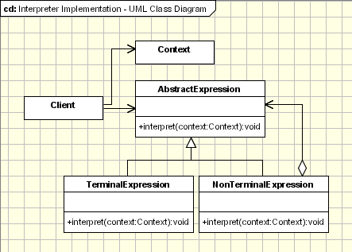

## [解释器 (Interpreter)](https://www.oodesign.com/interpreter-pattern.html)

### Motivation

The Interpreter is one of the Design Patterns published in the GoF which is not really used. Usually the Interpreter Pattern is described in terms of formal grammars, like it was described in the original form in the GoF but the area where this design pattern can be applied can be extended.

### Intent

为语言创建解释器，通常由语言的语法和语法分析来定义。

> - Given a language, define a representation for its grammar along with an interpreter that uses the representation to interpret sentences in the language.
> - Map a domain to a language, the language to a grammar, and the grammar to a hierarchical object-oriented design

### Class Diagram

- TerminalExpression：终结符表达式，每个终结符都需要一个 TerminalExpression。
- Context：上下文，包含解释器之外的一些全局信息。

<div align="center">  </div><br>

### Applicability & Examples

- The Interpreter pattern is used exhaustively in defining grammars, tokenize input and store it.
- A specific area where Interpreter can be used are the rules engines.
- The Interpreter pattern can be used to add functionality to the composite pattern.


#### Example 1 - Roman Numerals Convertor

The classical example fot the interpreter pattern is the one of interpreting the roman numerals. The expression to be interpreted is a string which is put in the context. The context consists of the remaining unparsed Roman Numeral string and of the result of the numeral that are already parsed. The context is passed to one of four sub-interpreters based on the type of interpreting(Thousand, Hundred, Ten, One). This example it's using only TerminalExpressions.

The following participant classes are involved in this example: 
- **Context** - keeps the current string that has to be parsed and the decimal that contains the conversion already done. Initially the context keeps the full string that has to be converted and 0 for the output decimal.

- **Expression** - Consists of the interpret method which receives the context. Based on the current object it uses specific values for Thousand, Hundred, Ten, One and a specific multiplier.

- **ThousandExpression, HundredExpression, TenExpression, OneExpression (TerminalExpression)** - Those classes are used to define each specific expression. Usually, the TerminalExpression classes implement the interpret method. In our case the method is already defined in the base Expression class and each TerminalExpression class defines its behaviour by implementing the abstract methods: one, four(), five(), nine(), multiplier(). It is a template method pattern.

- **Main(Client)* - In our little example this class is responsible to build the syntax tree representing a specific sentence in the language defined by the grammar. After the syntax tree is build the main method is invoking the interpret method.

````java
public class Context {

    private String input;
    private int output;

    public Context(String input)
    {
      this.input = input;
    }

    public String getInput()
    {
      return input;
    }
    
    public void setInput(String input)
    {
      this.input = input; 
    }    

    public int getOutput()
    {
      return output;
    }

    public void setOutput(int output)
    {
      this.output = output;
    }    
	
}

public abstract class Expression {

    public void interpret(Context context)
    {
      if (context.getInput().length() == 0) 
        return;

      if (context.getInput().startsWith(nine()))
      {
        context.setOutput(context.getOutput() + (9 * multiplier()));
        context.setInput(context.getInput().substring(2));
      }
      else if (context.getInput().startsWith(four()))
      {
        context.setOutput(context.getOutput() + (4 * multiplier()));
        context.setInput(context.getInput().substring(2));
      }
      else if (context.getInput().startsWith(five()))
      {
        context.setOutput(context.getOutput() + (5 * multiplier()));
        context.setInput( context.getInput().substring(1));
      }

      while (context.getInput().startsWith(one()))
      {
        context.setOutput(context.getOutput() + (1 * multiplier()));
        context.setInput(context.getInput().substring(1));
      }
    }

    public abstract String one();
    public abstract String four();
    public abstract String five();
    public abstract String nine();
    public abstract int multiplier();
	
}

public class ThousandExpression  extends Expression{

    public String one() { return "M"; }
    public String four(){ return " "; }
    public String five(){ return " "; }
    public String nine(){ return " "; }
    public int multiplier() { return 1000; }
}

public class HundredExpression extends Expression{
    public  String one() { return "C"; }
    public  String four(){ return "CD"; }
    public  String five(){ return "D"; }
    public  String nine(){ return "CM"; }
    public  int multiplier() { return 100; }
}

public class TenExpression  extends Expression{
    public String one() { return "X"; }
    public String four(){ return "XL"; }
    public String five(){ return "L"; }
    public String nine(){ return "XC"; }
    public int multiplier() { return 10; }
}

public class OneExpression  extends Expression{
    public String one() { return "I"; }
    public String four(){ return "IV"; }
    public String five(){ return "V"; }
    public String nine(){ return "IX"; }
    public int multiplier() { return 1; }
}

public class MainInterpreter {

	/**
	 * @param args
	 */
	public static void main(String[] args) {
		
	      String roman = "MCMXXVIII";
	      Context context = new Context(roman);

	      // Build the 'parse tree' 
	      ArrayList<Expression> tree = new ArrayList<Expression>();
	      tree.add(new ThousandExpression());
	      tree.add(new HundredExpression());
	      tree.add(new TenExpression());
	      tree.add(new OneExpression());

	      // Interpret 
	      for (Iterator it = tree.iterator(); it.hasNext();)
	      {
	    	  Expression exp = (Expression)it.next();
	    	  exp.interpret(context);
	      }

	      System.out.println(roman + " = " + Integer.toString(context.getOutput()));
	}
}
````


### JDK

- [java.util.Pattern](http://docs.oracle.com/javase/8/docs/api/java/util/regex/Pattern.html)
- [java.text.Normalizer](http://docs.oracle.com/javase/8/docs/api/java/text/Normalizer.html)
- All subclasses of [java.text.Format](http://docs.oracle.com/javase/8/docs/api/java/text/Format.html)
- [javax.el.ELResolver](http://docs.oracle.com/javaee/7/api/javax/el/ELResolver.html)
