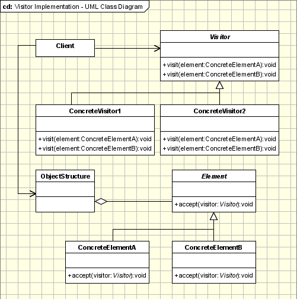

## [访问者 (Visitor)](https://www.oodesign.com/visitor-pattern.html)

### Motivation

Collections are data types widely used in object oriented programming. Often collections contain objects of different types and in those cases some operations have to be performed on all the collection elements without knowing the type.

 

A possible approach to apply a specific operation on objects of different types in a collection would be the use if blocks in conjunction with 'instanceof' for each element. This approach is not a nice one, not flexible and not object oriented at all. At this point we should think to the Open Close principle and we should remember from there that we can replace if blocks with an abstract class and each concrete class will implement its own operation.


### Intent

为一个对象结构（比如组合结构）增加新能力。

> - Represents an operation to be performed on the elements of an object structure.
> - Visitor lets you define a new operation without changing the classes of the elements on which it operates.

### Class Diagram

- Visitor：访问者，为每一个 ConcreteElement 声明一个 visit 操作
- ConcreteVisitor：具体访问者，存储遍历过程中的累计结果
- ObjectStructure：对象结构，可以是组合结构，或者是一个集合。

<div align="center">  </div><br>

The participants classes in this pattern are:
- **Visitor** - This is an interface or an abstract class used to declare the visit operations for all the types of visitable classes. Usually the name of the operation is the same and the operations are differentiated by the method signature: The input object type decides which of the method is called.
- **ConcreteVisitor** - For each type of visitor all the visit methods, declared in abstract visitor, must be implemented. Each Visitor will be responsible for different operations. When a new visitor is defined it has to be passed to the object structure.
- **Visitable** - is an abstraction which declares the accept operation. This is the entry point which enables an object to be "visited" by the visitor object. Each object from a collection should implement this abstraction in order to be able to be visited.
- **ConcreteVisitable** - Those classes implements the Visitable interface or class and defines the accept operation. The visitor object is passed to this object using the accept operation.
- **ObjectStructure** - This is a class containing all the objects that can be visited. It offers a mechanism to iterate through all the elements. This structure is not necessarily a collection. In can be a complex structure, such as a composite object.


### Applicability

The visitor pattern is used when:
- Similar operations have to be performed on objects of different types grouped in a structure (a collection or a more complex structure).
- There are many distinct and unrelated operations needed to be performed. Visitor pattern allows us to create a separate visitor concrete class for each type of operation and to separate this operation implementation from the objects structure.
- The object structure is not likely to be changed but is very probable to have new operations which have to be added. Since the pattern separates the visitor (representing operations, algorithms, behaviors) from the object structure it's very easy to add new visitors as long as the structure remains unchanged.


### [Example](https://www.oodesign.com/visitor-pattern-customers-report-java-sourcecode.html)

```java
public interface Element {
    void accept(Visitor visitor);
}
```

```java
class CustomerGroup {

    private List<Customer> customers = new ArrayList<>();

    void accept(Visitor visitor) {
        for (Customer customer : customers) {
            customer.accept(visitor);
        }
    }

    void addCustomer(Customer customer) {
        customers.add(customer);
    }
}
```

```java
public class Customer implements Element {

    private String name;
    private List<Order> orders = new ArrayList<>();

    Customer(String name) {
        this.name = name;
    }

    String getName() {
        return name;
    }

    void addOrder(Order order) {
        orders.add(order);
    }

    public void accept(Visitor visitor) {
        visitor.visit(this);
        for (Order order : orders) {
            order.accept(visitor);
        }
    }
}
```

```java
public class Order implements Element {

    private String name;
    private List<Item> items = new ArrayList();

    Order(String name) {
        this.name = name;
    }

    Order(String name, String itemName) {
        this.name = name;
        this.addItem(new Item(itemName));
    }

    String getName() {
        return name;
    }

    void addItem(Item item) {
        items.add(item);
    }

    public void accept(Visitor visitor) {
        visitor.visit(this);

        for (Item item : items) {
            item.accept(visitor);
        }
    }
}
```

```java
public class Item implements Element {

    private String name;

    Item(String name) {
        this.name = name;
    }

    String getName() {
        return name;
    }

    public void accept(Visitor visitor) {
        visitor.visit(this);
    }
}
```

```java
public interface Visitor {
    void visit(Customer customer);

    void visit(Order order);

    void visit(Item item);
}
```

```java
public class GeneralReport implements Visitor {

    private int customersNo;
    private int ordersNo;
    private int itemsNo;

    public void visit(Customer customer) {
        System.out.println(customer.getName());
        customersNo++;
    }

    public void visit(Order order) {
        System.out.println(order.getName());
        ordersNo++;
    }

    public void visit(Item item) {
        System.out.println(item.getName());
        itemsNo++;
    }

    public void displayResults() {
        System.out.println("Number of customers: " + customersNo);
        System.out.println("Number of orders:    " + ordersNo);
        System.out.println("Number of items:     " + itemsNo);
    }
}
```

```java
public class Client {
    public static void main(String[] args) {
        Customer customer1 = new Customer("customer1");
        customer1.addOrder(new Order("order1", "item1"));
        customer1.addOrder(new Order("order2", "item1"));
        customer1.addOrder(new Order("order3", "item1"));

        Order order = new Order("order_a");
        order.addItem(new Item("item_a1"));
        order.addItem(new Item("item_a2"));
        order.addItem(new Item("item_a3"));
        Customer customer2 = new Customer("customer2");
        customer2.addOrder(order);

        CustomerGroup customers = new CustomerGroup();
        customers.addCustomer(customer1);
        customers.addCustomer(customer2);

        GeneralReport visitor = new GeneralReport();
        customers.accept(visitor);
        visitor.displayResults();
    }
}
```

```html
customer1
order1
item1
order2
item1
order3
item1
customer2
order_a
item_a1
item_a2
item_a3
Number of customers: 2
Number of orders:    4
Number of items:     6
```

Hot Points:

- The visitor pattern is a great way to provide a flexible design for adding new visitors to extend existing functionality without changing existing code
- The Visitor pattern comes with a drawback: If a new visitable object is added to the framework structure all the implemented visitors need to be modified. The separation of visitors and visitable is only in one sense: visitors depend of visitable objects while visitable are not dependent of visitors.
- Part of the dependency problems can be solved by using reflection with a performance cost.


### JDK

- javax.lang.model.element.Element and javax.lang.model.element.ElementVisitor
- javax.lang.model.type.TypeMirror and javax.lang.model.type.TypeVisitor
