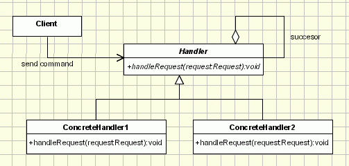

## [责任链（Chain Of Responsibility](https://www.oodesign.com/chain-of-responsibility-pattern.html)

### Motivation

In writing an application of any kind, it often happens that the event generated by one object needs to be handled by another one. And, to make our work even harder, we also happen to be denied access to the object which needs to handle the event. In this case there are two possibilities: there is the beginner/lazy approach of making everything public, creating reference to every object and continuing from there and then there is the expert approach of using the Chain of Responsibility.

The Chain of Responsibility design pattern allows an object to send a command without knowing what object will receive and handle it. The request is sent from one object to another making them parts of a chain and each object in this chain can handle the command, pass it on or do both. The most usual example of a machine using the Chain of Responsibility is the vending machine coin slot: rather than having a slot for each type of coin, the machine has only one slot for all of them. The dropped coin is routed to the appropriate storage place that is determined by the receiver of the command.


### Intent

使多个对象都有机会处理请求，从而避免请求的发送者和接收者之间的耦合关系。将这些对象连成一条链，并沿着这条链发送该请求，直到有一个对象处理它为止。

> It avoids attaching the sender of a request to its receiver, giving this way other objects the possibility of handling the request too.

> The objects become parts of a chain and the request is sent from one object to another across the chain until one of the objects will handle it.


### Class Diagram

- Handler：定义处理请求的接口，并且实现后继链（successor）

<div align="center">  </div><br>

- **Handler** - defines an interface for handling requests
- **RequestHandler** - handles the requests it is responsible for
If it can handle the request it does so, otherwise it sends the request to its successor
- **Client** - sends commands to the first object in the chain that may handle the command

Here is how sending a request works in the application using the Chain of Responsibility: the Client in need of a request to be handled sends it to the chain of handlers, which are classes that extend the Handler class. Each of the handlers in the chain takes its turn at trying to handle the request it receives from the client. If ConcreteHandler_i can handle it, then the request is handled, if not it is sent to the handler ConcreteHandler_i+1, the next one in the chain.

````java
public class Request {	
	private int m_value;
	private String m_description;

	public Request(String description, int value)
	{
		m_description = description;
		m_value = value;
	}

	public int getValue()
	{
		return m_value;
	}

	public String getDescription()
	{
		return m_description;
	}          
}

public abstract class Handler
{
	protected Handler m_successor;
	public void setSuccessor(Handler successor)
	{
		m_successor = successor;
	}

	public abstract void handleRequest(Request request);
}

public class ConcreteHandlerOne extends Handler
{
	public void handleRequest(Request request)
	{
		if (request.getValue() < 0)
		{           //if request is eligible handle it
			System.out.println("Negative values are handled by ConcreteHandlerOne:");
			System.out.println("\tConcreteHandlerOne.HandleRequest : " + request.getDescription()
						 + request.getValue());
		}
		else
		{
			super.handleRequest(request);
		}
	}
 }

public class ConcreteHandlerThree extends Handler
{
	public void handleRequest(Request request)
	{
		if (request.getValue() >= 0)
		{           //if request is eligible handle it
			System.out.println("Zero values are handled by ConcreteHandlerThree:");
			System.out.println("\tConcreteHandlerThree.HandleRequest : " + request.getDescription()
						 + request.getValue());
		}
        else
		{
			super.handleRequest(request);
		}
	}
}

public class ConcreteHandlerTwo extends Handler
{
	public void handleRequest(Request request)
	{
		if (request.getValue() > 0)
		{           //if request is eligible handle it
			System.out.println("Positive values are handled by ConcreteHandlerTwo:");
			System.out.println("\tConcreteHandlerTwo.HandleRequest : " + request.getDescription()
						 + request.getValue());
		}
        else
		{
			super.handleRequest(request);
		}
	}
}

public class Main 
{
	public static void main(String[] args) 
	{
		// Setup Chain of Responsibility
		Handler h1 = new ConcreteHandlerOne();
		Handler h2 = new ConcreteHandlerTwo();
		Handler h3 = new ConcreteHandlerThree();
		h1.setSuccessor(h2);
		h2.setSuccessor(h3);

		// Send requests to the chain
		h1.handleRequest(new Request("Negative Value ", -1));
		h1.handleRequest(new Request("Negative Value ",  0));
		h1.handleRequest(new Request("Negative Value ",  1));
		h1.handleRequest(new Request("Negative Value ",  2));
		h1.handleRequest(new Request("Negative Value ", -5));	    
	}
}
````


### Implementation

```java
public abstract class Handler {

    protected Handler successor;

    public Handler(Handler successor) {
        this.successor = successor;
    }

    protected abstract void handleRequest(Request request);
}
public class ConcreteHandler1 extends Handler {

    public ConcreteHandler1(Handler successor) {
        super(successor);
    }

    @Override
    protected void handleRequest(Request request) {
        if (request.getType() == RequestType.TYPE1) {
            System.out.println(request.getName() + " is handle by ConcreteHandler1");
            return;
        }
        if (successor != null) {
            successor.handleRequest(request);
        }
    }
}

public class ConcreteHandler2 extends Handler {

    public ConcreteHandler2(Handler successor) {
        super(successor);
    }

    @Override
    protected void handleRequest(Request request) {
        if (request.getType() == RequestType.TYPE2) {
            System.out.println(request.getName() + " is handle by ConcreteHandler2");
            return;
        }
        if (successor != null) {
            successor.handleRequest(request);
        }
    }
}

public class Request {

    private RequestType type;
    private String name;


    public Request(RequestType type, String name) {
        this.type = type;
        this.name = name;
    }

    public RequestType getType() {
        return type;
    }

    public String getName() {
        return name;
    }
}

public enum RequestType {
    TYPE1, TYPE2
}

public class Client {

    public static void main(String[] args) {

        Handler handler1 = new ConcreteHandler1(null);
        Handler handler2 = new ConcreteHandler2(handler1);

        Request request1 = new Request(RequestType.TYPE1, "request1");
        handler2.handleRequest(request1);

        Request request2 = new Request(RequestType.TYPE2, "request2");
        handler2.handleRequest(request2);
    }
}
```

```html
request1 is handle by ConcreteHandler1
request2 is handle by ConcreteHandler2
```

### Applicability & Examples

Having so many design patterns to choose from when writing an application, it's hard to decide on which one to use, so here are a few situations when using the Chain of Responsibility is more effective:

- More than one object can handle a command
- The handler is not known in advance
- The handler should be determined automatically
- It’s wished that the request is addressed to a group of objects without explicitly specifying its receiver
- The group of objects that may handle the command must be specified in a dynamic way

#### Example 1

In designing the software for a system that approves the purchasing requests.

In this case, the values of purchase are divided into categories, each having its own approval authority. The approval authority for a given value could change at any time and the system should be flexible enough to handle the situation.

The Client in the example above is the system in need of the answer to the approval. It sends a request about it to an purchase approval authority. Depending on the value of the purchase, this authority may approve the request or forward it to the next authority in the chain.

For example let’s say a request is placed for the purchase of a new keyboard for an office. The value of the purchase is not that big, so the request is sent from the head of the office to the head of the department and then to the materials department where it stops, being handled locally. But if equipment for the whole department is needed then the request goes form the head of the department, to materials department, to the purchase office and even to the manager if the value is too big.

### Specific problems and implementation

- Representing requests

- Broken Chain 

    Sometimes we could forget to include in the implementation of the handleRequest method the call to the successor, causing a break in the chain. The request isn’t sent forward from the broken link and so it ends up unhandled. A variation of the pattern can be made to send the request to all the handlers by removing the condition from the handler and always calling the successor.

    The following implementation eliminates the Broken Chain problem. The implementation moves the code to traverse the chain into the base class keeping the request handling in a different method in the subclasses. The handleRequest method is declared as final in the base class and is responsible to traverse the chain. Each Handler have to implement the handleRequestImpl method, declared as abstract in the super class.

    ````java
    public abstract class Handler{
        private Handler m_successor;

        public void setSuccessor(Handler successor)
        {
            m_successor = successor;
        }
        protected abstract boolean handleRequestImpl(Request request);
        public final void handleRequest(Request request)
        {
            boolean handledByThisNode = this.handleRequestImpl(request);
            if (m_successor != null && !handledByThisNode)
            {
                m_successor.handleRequest(request);
            }
        }      
    }

    protected boolean handleRequestImpl(Request request)
    {
        if (request.getValue() < 0)
        {	    //if request is eligible handle it
            System.out.println("Negative values are handled by ConcreteHandlerOne:");
            System.out.println("\tConcreteHandlerOne.HandleRequest : " + request.getDescription() 
                            + request.getValue());
            return true;
        }
        else
        {
            return false;
        }
    }
    ````
- Avoiding spam requests

    ````java
    public void HandleRequest(int request) 
    {
        if(isSpam(request))   
        { // if the request is spam take spam-related actions
            ...
        }
        else 
        { // request is not spam.
            super.HandleRequest(request); // Pass message to next filter in the chain.
        }
    }
    ````

- Use on existing code

### Hot points

- The fundamental flaw of the pattern is the fact that **it gets easily broken**: if the programmer forgets to call the next handler in the concreteHandler the request gets lost on the way. This problem comes from the fact that the execution is not handled entirely by the superclass and the call is triggered in the superclass.
- When implementing the CoR pattern a special care should be taken for **the request representation**. The request is not considered a distinctive part of the CoR pattern, but it is still used in all the components of the pattern.
- Another flaw of the Chain of Responsibility is the fact that **some requests may end up unhandled due to the wrong implementation of concrete handler**, their propagation slowing down the rest of the application. This means that extra care is needed when taking into account the requests that may appear in the process.


### JDK

- [java.util.logging.Logger#log()](http://docs.oracle.com/javase/8/docs/api/java/util/logging/Logger.html#log%28java.util.logging.Level,%20java.lang.String%29)
- [Apache Commons Chain](https://commons.apache.org/proper/commons-chain/index.html)
- [javax.servlet.Filter#doFilter()](http://docs.oracle.com/javaee/7/api/javax/servlet/Filter.html#doFilter-javax.servlet.ServletRequest-javax.servlet.ServletResponse-javax.servlet.FilterChain-)
