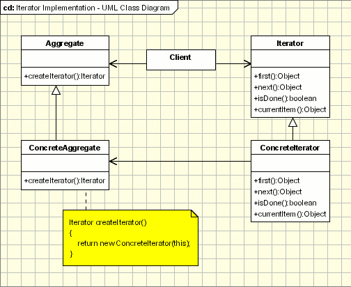

## [迭代器(Iterator)](https://www.oodesign.com/iterator-pattern.html)

### Motivation

One of the most common data structures in software development is what is generic called a collection. A collection is just a grouping of some objects. They can have the same type or they can be all cast to a base type like object. A collection can be a list, an array, a tree and the examples can continue. 

But what is more important is that a collection should provide a way to access its elements without exposing its internal structure. We should have a mechanism to traverse in the same way a list or an array. It doesn't matter how they are internally represented. 

The idea of the iterator pattern is to take the responsibility of accessing and passing trough the objects of the collection and put it in the iterator object. The iterator object will maintain the state of the iteration, keeping track of the current item and having a way of identifying what elements are next to be iterated. 


### Intent

提供一种顺序访问聚合对象元素的方法，并且不暴露聚合对象的内部表示。

> - Provide a way to access the elements of an aggregate object sequentially without exposing its underlying representation. 
> - The abstraction provided by the iterator pattern allows you to modify the collection implementation without making any changes outside of collection. It enables you to create a general purpose GUI component that will be able to iterate through any collection of the application. 


### Class Diagram

- Aggregate 是聚合类，其中 createIterator() 方法可以产生一个 Iterator；
- Iterator 主要定义了 hasNext() 和 next() 方法；
- Client 组合了 Aggregate，为了迭代遍历 Aggregate，也需要组合 Iterator。

<div align="center">  </div><br>

### Applicability & Examples

The iterator pattern allow us to:

- access contents of a collection without exposing its internal structure.
- support multiple simultaneous traversals of a collection.
- provide a uniform interface for traversing different collection.

#### Example 1
This exmple is using a collection of books and it uses an iterator to iterate through the collection. The main actors are:
- **IIterator** - This interface represent the AbstractIterator, defining the iterator
- **BookIterator** - This is the implementation of Iterator(implements the IIterator interface)
- **IContainer** - This is an interface defining the Agregate
- **BooksCollection** - An implementation of the collection

Here is the code for the abstractions IIterator and IContainer:

````java
interface IIterator
{
	public boolean hasNext();
	public Object next();
}

interface IContainer
{
	public IIterator createIterator();
}
````

And here is the code for concrete classes for iterator and collection. Please note that the concrete iterator is an nested class. This way it can access all the members of the collection and it is encapsulated so other classes can not access the BookIterator. All the classes are not aware of BookIterator they uses the IIterator:

````java
class BooksCollection implements IContainer
{
	private String m_titles[] = {"Design Patterns","1","2","3","4"};

	public IIterator createIterator()
	{
		BookIterator result = new BookIterator();
		return result;
	}

	private class BookIterator implements IIterator
	{
		private int m_position;

		public boolean hasNext()
		{
			if (m_position < m_titles.length)
				return true;
			else
				return false;
		}
		public Object next()
		{
			if (this.hasNext())
				return m_titles[m_position++];
			else
				return null;
		}
	}
}
````

### Implementation - External Iterator


````java
public interface Aggregate {
    Iterator createIterator();
}

public class ConcreteAggregate implements Aggregate {

    private Integer[] items;

    public ConcreteAggregate() {
        items = new Integer[10];
        for (int i = 0; i < items.length; i++) {
            items[i] = i;
        }
    }

    @Override
    public Iterator createIterator() {
        return new ConcreteIterator<Integer>(items);
    }
}

public interface Iterator<Item> {

    Item next();

    boolean hasNext();
}

public class ConcreteIterator<Item> implements Iterator {

    private Item[] items;
    private int position = 0;

    public ConcreteIterator(Item[] items) {
        this.items = items;
    }

    @Override
    public Object next() {
        return items[position++];
    }

    @Override
    public boolean hasNext() {
        return position < items.length;
    }
}

public class Client {

    public static void main(String[] args) {
        Aggregate aggregate = new ConcreteAggregate();
        Iterator<Integer> iterator = aggregate.createIterator();
        while (iterator.hasNext()) {
            System.out.println(iterator.next());
        }
    }
}
````

### Specific problems and implementation

- Iterator and multithreading
- External vs. internal iterators
    - **External Iterators** - when the iteration is controlled by the collection object we say that we have an external Iterator. 
    - **Internal Iterators** - When the iterator controls it we have an internal iterator.
- Who defines the traversal algorithm?
- Robust Iterators

### Hot Spot

- **External vs. internal iterators** - In languages like Java, C#, VB .NET, C++ is very easy to use external iterators.
- **Who defines the traversal algorithm?** - The aggregate can implement it or the iterator as well. Usually the algorithm is defined in the iterator.
- **Robust Iterators** - Can the aggregate be modified while a traversal is ongoing?
- **Multithreading iterators** - First of all multithreading iterators should be robust iterators. Second of all they should work in multithreading environments.

### JDK

- [java.util.Iterator](http://docs.oracle.com/javase/8/docs/api/java/util/Iterator.html)
- [java.util.Enumeration](http://docs.oracle.com/javase/8/docs/api/java/util/Enumeration.html)
